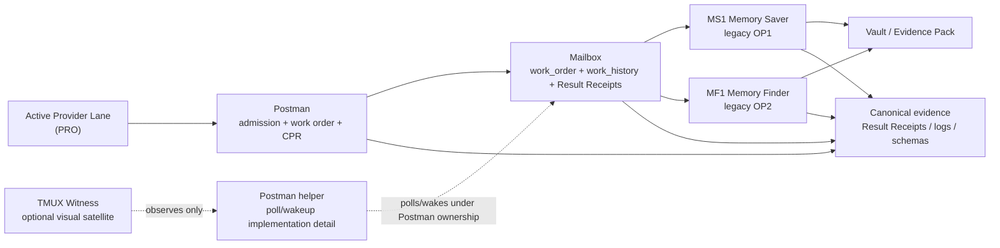
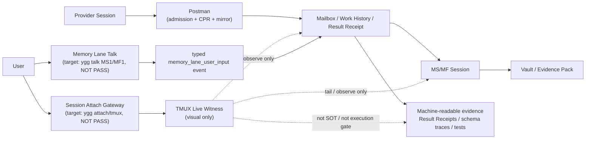

<p align="center">
  <h1 align="center">🌳 openyggdrasil</h1>
  <p align="center">
    <strong>프로바이더 중립적 AI 코딩 에이전트 메모리 엔진</strong>
  </p>
  <p align="center">
    <em>프로바이더 간 축적되는<br/>
    영속적이고 생명주기 인식 가능한 지식 계층 —
    <a href="https://gist.github.com/karpathy/442a6bf555914893e9891c11519de94f">Karpathy의 LLM Wiki</a>에서 영감을 받았습니다.</em>
  </p>
  <p align="center">
    <a href="./README.md">English</a> · 한국어
  </p>
</p>

<p align="center">
  <a href="#start-here">처음 읽기</a> •
  <a href="#setup">설정</a> •
  <a href="#why">왜 필요한가</a> •
  <a href="#how-it-works">시스템 아키텍처</a> •
  <a href="#ptc">PTC</a> •
  <a href="#modules">모듈</a> •
  <a href="#reasoning-lease">Reasoning Lease</a> •
  <a href="#inspirations">영감</a>
</p>

<a id="start-here"></a>

## 처음 읽기

openyggdrasil은 AI 코딩 에이전트가 세션과 프로바이더를 넘어 오래 남겨야 할 프로젝트 지식을 저장, 회상, 개정하도록 돕는 로컬 프로바이더 중립 메모리 계층입니다. 원본 대화 전체를 기억으로 덤프하지 않고, 나중에 다시 찾을 수 있는 주제와 근거를 Vault / LLM Wiki에 정리하는 방향을 지향합니다.

현재 미션은 좁습니다:

```text
사용자 / Provider 대화에서 오래 남길 주제를 LLM Wiki에 축적한다.
나중에 사용자가 자연어로 물으면 관련 주제, 최신성, 근거를 회상한다.
회상 결과를 현재 Provider 대화에 Evidence Pack과 함께 되돌린다.
```

현재 실행 아키텍처는 **Provider-first + Postman mailbox-first + MS/MF worker pair**입니다:

```text
Provider
  -> Postman delivery admission
  -> mailbox work_order / work_history
  -> MS Memory Saver 또는 MF Memory Finder native worker
  -> worker_structured_receipt.v1 / Result Receipt
  -> Vault 또는 Evidence Pack
  -> Provider 현재 대화 판단면
```

Provider는 사용자와 대화하는 판단면입니다. Postman은 편지를 접수하고,
work order를 만들고, MS/MF를 깨우고, 결과 receipt와 work history를
정리합니다. MS/MF는 각자 받은 명세서를 읽고 스스로 작업을 계획하고,
행동하고, 관찰하고, 충분/부족을 판정한 뒤 구조화된 receipt로 닫습니다.
TMUX pane은 이 의사결정 표면을 사람이 보는 live witness일 뿐 SOT가 아닙니다.

현재 상태는 이렇게 낮춰 읽어야 합니다:

- 이 프로젝트는 아직 production-ready 제품이 아닙니다.
- Full UX, multi-provider parity, Graphify full topology, Hermes true hot reload는 이 README만으로 주장하지 않습니다.
- `./scripts/ygg doctor/status/pro1/ms1/mf1`은 public repo 안의 repo-local 관찰 명령면으로 구현되었습니다. 전역 `ygg`가 첫 설치 환경에 이미 있다고 가정하지 않습니다.
- Hermes 기반 POC는 중요한 근거일 수 있지만, 그 자체로 provider-neutral 동작 증명은 아닙니다.

품질 판단은 두 축으로 나눕니다:

| 축 | 질문 |
|---|---|
| 생산 품질 | 지식이 의도한 체인으로 저장됐고, 출처와 배치와 Result Receipt가 남았는가? |
| 소비 품질 | Provider가 나중에 올바른 지식을 찾고, 신뢰하고, 현재 답변에 자연스럽게 썼는가? |

충돌하는 주장이 있을 때는 다음 순서로 판단합니다:

1. 사용자 승인 교정
2. 명시적 SOT 문서
3. Vault / LLM Wiki canonical page
4. Source, provenance, evidence pointer
5. PTC trace와 평가 결과
6. Mailbox Result Receipt
7. Graphify community signal
8. Worker summary

Worker summary, mailbox receipt, Graphify community signal은 도움이 되는 근거지만 단독 SOT가 아닙니다. POC PASS도 그 POC가 검증한 범위만 승격합니다.

이 README에서 사용자에게 먼저 노출하는 표준 용어:

| 용어 | 의미 | 내부/호환 이름 |
|---|---|---|
| Provider Unit N | 하나의 Provider lane과 그 주변 memory 위성 묶음 | PRO N + MS N + MF N |
| PRO N | 사용자와 직접 대화하는 Provider lane | Provider Lane N |
| MS N | 기억 저장 담당 | Memory Saver, legacy OP(2N - 1) |
| MF N | 기억 회상 담당 | Memory Finder, legacy OP(2N) |
| Postman | 편지 접수, work order/history 작성, MS/MF CPR, receipt mirror 조율 | delivery/admission/heartbeat owner |
| Work Order | MS/MF가 실제로 읽어야 하는 작업 명세서 | `postman_work_order.v1` |
| Work History | 작업 진행과 결과의 append-only 히스토리 | `worker_work_history.v1` |
| Worker Structured Receipt | MS/MF가 작업을 닫을 때 남기는 구조화 결과 | `worker_structured_receipt.v1` |
| Status Brief | 상태 요약 | internal CPR/operator_brief |
| Evidence Pack | 근거 묶음 | internal support_bundle |
| Result Receipt | 처리 결과 영수증 | internal receipt/query_receipt |
| Save Request | 기억 저장 요청 | internal MemoryTicket/Save Request |
| Find Request | 기억 회상 요청 | internal recall query |
| Checkpoint | 검증 관문 | internal gate/proof/POC |

`OP`, `producer`, `consumer`, `operator` 이름은 런타임 스키마, 파일 경로, 코드 모듈, 과거 호환 id를 설명할 때만 남깁니다. 사용자가 먼저 읽는 역할명은 Provider, Postman, MS, MF입니다. Postman은 의미 품질 소유자가 아니라 메일 접수, work order, CPR, receipt/history 조율 소유자입니다.

Use this when:
- 이 레포지토리를 처음 봅니다.
- 사용자가 레포지토리 URL이나 경로만 제공합니다.
- 사용자가 로컬 설치 또는 실행 가능 여부를 묻습니다.
- 명령을 실행하기 전에 무엇을 먼저 읽어야 할지 판단해야 합니다.

Do not use this when:
- production-ready, Full UX PASS, multi-provider parity, 완료도 수치를 주장하려 합니다.
- 파일, 테스트, Result Receipt, README 문구만 보고 MS1/MF1 live 동작을 추정하려 합니다.
- 사용자 승인 없이 추가 memory worker, background session, global command를 만들려 합니다.

If ambiguous:
- URL만 받은 요청은 코드 리뷰가 아니라 레포지토리 orientation으로 취급합니다.
- 먼저 이 레포지토리가 무엇인지 몇 문장으로 설명합니다.
- 설치 가능성 요청이면 local prerequisite, 문서화된 설치 표면, dependency resolver, 가장 작은 smoke 또는 healthcheck만 확인합니다.
- 사용자가 요청하지 않은 과거 기록 뒤지기, LOC inventory, 전체 아키텍처 리뷰, 완료 상태 승격을 하지 않습니다.

읽는 순서:
1. 설정 섹션에서 지원 환경과 콜드스타트 규칙을 확인합니다.
2. 설치 전에 로컬 선행 요건을 확인합니다.
3. 패키지나 시스템 의존성을 설치하기 전에는 사용자 허가를 받습니다.
4. 왜 필요한가 섹션에서 RAG와 다른 점을 확인합니다.
5. 시스템 아키텍처, PTC, 모듈, Reasoning Lease를 순서대로 읽습니다.
6. 설정 후에는 이전 로컬 환경의 가정이 아니라 이 레포지토리의 계약과 런타임 근거를 기준으로 판단합니다.

Typed unavailable when:
- 레포지토리가 아직 clone되지 않았거나 작업 디렉토리가 불명확합니다.
- 필요한 로컬 선행 요건이 없고 사용자가 설치를 승인하지 않았습니다.
- 요청된 Provider Unit live claim을 사용자가 볼 수 있는 live lane에서 관측할 수 없습니다.
- 요청된 source, Result Receipt, Vault node를 구체적 근거로 해소할 수 없습니다.

Required evidence refs:
- 정적 문서 주장은 파일 경로와 행 번호가 필요합니다.
- 런타임 주장은 명령 출력 또는 테스트 결과가 필요합니다.
- Provider Unit workflow 주장은 mailbox, Result Receipt, event log 근거가 필요합니다.
- Live UX 주장은 machine-readable evidence에 더해 사용자가 관측 가능한 tmux/live-lane 근거가 필요합니다.

Hard nonclaims:
- 이 최상단 문구는 production-ready 선언이 아닙니다.
- README 최상단은 PASS 인증서가 아닙니다.
- 완료도 표, plan, test count, Result Receipt만으로 Full UX PASS를 증명하지 않습니다.
- Hermes 전용 근거는 provider-neutral 동작 증명이 아닙니다.
- `ygg`, MS1/MF1(legacy OP1/OP2), attach, talk 명령은 setup 검증 전 존재한다고 가정하지 않습니다.

---

<a id="setup"></a>

## 시스템 요구사항 및 설정

openyggdrasil은 Hermes, Claude Code, Cursor 같은 AI 프로바이더에 붙는
세션 단위 콜드스타트 스킬을 지향합니다. 목표 운영 모델은 상시 실행 시스템
서버나 별도 서버 관리를 요구하지 않습니다. 다만 active Provider Lane 주변에
세션 단위 Postman helper와 MS/MF worker가 생길 수 있고, 이들은 반드시 수명주기와
cleanup 검증에 묶여야 합니다. 이는 아직 production-ready 보장이 아닙니다.

> **⚠️ 추론 토큰 임대 모델 (비동기 다중화 / Asynchronous Multiplexing):**
> openyggdrasil은 자체 API 키를 가지지 않으며, 프로바이더 자격 증명을 추출해서도 안 됩니다.
> Memory Worker는 사용자와의 대화를 막지 않도록 비동기 백그라운드 작업 경계를 지향합니다. 이 경로는 사용자가 승인한 active provider session의 명시적 작업 계약 안에서만 실행되어야 합니다. 프로바이더 어댑터는 scoped delegation 또는 task-contract multiplexing 같은 추론 임대 경계를 제공할 수 있지만, 공통 경계는 provider-neutral로 남아야 하며 아직 production-ready로 닫히지 않았습니다.

### 1. 프로바이더가 openyggdrasil을 인식하는 방법

프로바이더는 레포지토리 루트의 **`SKILL.md`** 매니페스트를 읽어 openyggdrasil에
연결합니다:
- 에이전트의 스킬 설정을 `SKILL.md`의 절대 경로로 지정합니다.
- 에이전트가 이 계약을 읽으면, 메모리 검색 및 캡처를 위한 정확한 진입점,
  명령 형태, 경계를 파악합니다.

Provider-first 콜드스타트 규칙:

- 사용자는 먼저 Hermes, Claude Code, Codex, Cursor 같은 정상 프로바이더 UX로 세션을 엽니다.
- 그다음 프로바이더가 openyggdrasil 레포지토리 경로, URL, 또는 스킬 참조를 받고 `SKILL.md`를 읽습니다.
- 첫 설치 환경은 전역 `ygg` 명령이나 `ygg pro1`, `ygg ms1`, `ygg mf1` 같은 attach 명령이 이미 존재한다고 가정하면 안 됩니다.
- bootstrap 전에 `ygg-*` attach wrapper, legacy `oy-*` wrapper, 또는 사전 설치된 `ygg` 명령이 전역에 보이면, session-group health record로 검증되기 전까지는 로컬/개발 잔존물로 취급합니다.
- 레포지토리 안의 로컬 도구는 프로바이더가 레포지토리를 인식한 뒤 발견하는 bootstrap 자산입니다. 프로바이더 세션이 이미 붙었다는 근거가 아닙니다.
- `ygg pro1`은 보편적인 첫 진입점도, provider identity도 아닙니다. openyggdrasil을 인식한 뒤 사용할 수 있는 선택적 Provider attach/witness 명령입니다. 내부 tmux 세션명은 `ygg-pro1`일 수 있습니다.

활성 세션 health는 lane 단독이 아니라 그룹 단위로 봅니다:

```text
사용자 명령   내부 tmux   Runtime evidence
ygg pro1      ygg-pro1        provider_lane.v1
ygg ms1       ygg-ms1      MS1 Memory Saver registry/mailbox/work_order/live worker (legacy OP1 evidence id 가능)
ygg mf1       ygg-mf1      MF1 Memory Finder registry/mailbox/work_order/live worker (legacy OP2 evidence id 가능)
정본 근거                  mailbox work_order/history / Result Receipts / event logs / attachment artifacts
```

이 그룹 중 한쪽이라도 stale이면 전체 그룹은 degraded입니다. 불확실하다고 해서 `oy-2`, `oy-3` 또는 추가 MS/MF pair를 자동 fallback으로 만들면 안 됩니다. 새 Provider Unit MS/MF pair는 명시적으로 만들고 다시 bind해야 합니다.

### 2. 시스템 요구사항 & 의존성 설치

openyggdrasil은 순수 로컬에서 실행됩니다. 코어 런타임은 Python 표준
라이브러리에 거의 전적으로 의존하지만, Graphify 파생 뷰와 샌드박스 격리에
다음 의존성 스택이 필요합니다:

**지원 운영체제:**
- **Linux / WSL2 전용**: openyggdrasil의 핵심인 Reasoning Lease 샌드박스는 `bubblewrap`을 통한 비특권 리눅스 컨테이너 격리 환경에 의존합니다.
  - **주의 (Cross-OS 교차 실행):** Windows 네이티브 프로바이더가 WSL2 내부의 openyggdrasil을 호출하는 교차 실행(Cross-border Tunneling)은 물리적으로 가능하지만 **강력히 비권장(Not Recommended)**합니다. Windows-WSL2 경로 번역, 9P 프로토콜의 I/O 성능 저하, Stdin/Stdout 인코딩 차이 때문에 데드락 가능성이 큽니다. 안정적으로 쓰려면 프로바이더 본체도 가급적 WSL2 안에서 직접 실행하십시오.

**코어 선행 요건:**
- **`Python 3.10+`**: 로컬 환경에 설치되어 접근 가능해야 합니다.

**Python 패키지 (pip):**
- **`graphifyy`**: <https://github.com/safishamsi/graphify> 의 공식 Graphify 패키지입니다. 설치 전 현재 PyPI 최신 버전을 확인(`python -m pip index versions graphifyy`)하고 PyPI에서 최신으로 설치/업그레이드(`python -m pip install -U graphifyy` 또는 `python -m pip install -U -r requirements.txt`)해야 합니다. CLI/import 표면은 `graphify`입니다.
- **`networkx`**: 그래프 파생, 노드 인덱싱, 탐색, Louvain 커뮤니티 탐지용
- **`jsonschema`**: 프로바이더 계약 및 메일박스 스키마의 엄격한 검증용
- **`pyyaml`**: 설정 및 매니페스트 파일 읽기/쓰기용
- **`rank-bm25`**: Pathfinder의 로컬 BM25 키워드 검색용
- **`pytest`**: 로컬 계약 검증 및 스모크 테스트용
- **`kiwipiepy`**: (LGPL v3, (c) bab2min) 한국어 형태소 분석 및 문장 분리. https://github.com/bab2min/kiwi

**시스템 의존성:**
- **`bubblewrap`** (`bwrap`): Reasoning Lease 실행 시 비특권 샌드박스 격리에 **필수** (Linux/WSL).
- **`socat`**: WSL2/Linux provider worker의 live/sandbox readiness와 Unix socket/stream 브릿지 검증에 필요.

**이 의존성들은 사용자의 로컬 환경에 설치되어야 합니다.**

> **⚠️ 프로바이더 필수 규칙:**
> 초기 셋업(Cold Start) 스킬을 처음 실행하기 전에, 프로바이더는 **반드시 사용자에게 명시적 허가를 요청**해야 합니다.
>
> 1. 프로바이더가 의존성 누락을 감지합니다.
> 2. 프로바이더가 중단하고 사용자에게 프롬프트: *"openyggdrasil은 로컬 Python 패키지와 WSL2/Linux 시스템 의존성이 필요합니다. 설치/확인을 허용하시겠습니까?"*
> 3. 사용자 승인 시에만 의존성을 설치하거나 확인합니다. **무단 또는 프롬프트 없는 설치는 엄격히 금지됩니다.**

### 3. 세션 스코프 콜드스타트 (Session-Scoped Cold Start)

의존성이 승인되고 설치되면, 프로바이더는 `SKILL.md`에 정의된 스킬 진입점을
실행할 수 있습니다. openyggdrasil 런타임은 **프로바이더 세션 단위로 콜드스타트**됩니다.
시스템 레벨 백그라운드 데몬은 없지만, 프로바이더 세션에 바인딩된 Memory Worker Session이
세션 수명 동안 Postman/Mailbox 작업 원장에 묶여 상주할 수 있습니다. 작업이 끝나거나 타임아웃되면
정리되어야 합니다.

깨끗한 콜드스타트의 의미:

- 이미 attach된 Provider lane을 가정하지 않습니다.
- 전역 `ygg-*` attach wrapper 또는 legacy `oy-*` 명령을 요구하지 않습니다.
- 이전 MS/MF registry pair를 health 근거 없이 신뢰하지 않습니다.
- 이전 Vault proof artifact를 현재 runtime state로 취급하지 않습니다.
- 프로바이더가 workspace를 발견하고 검증한 뒤에만 attach/witness lane을 안내합니다.

### 4. 위성 운영 모델 (Satellite Operating Model)

openyggdrasil은 **서버 모델**이 아니라 **위성 모델**입니다.

중심에는 active Provider Session이 있습니다. Postman, Mailbox, Memory Saver,
Memory Finder, 선택적 TMUX pane은 그 세션 주위를 도는 위성입니다. 이들은 active
Provider Session을 보조하기 위해 존재하며, 독립적인 상시 서버가 되면 안 됩니다.
Postman은 별도 의미 판단자가 아니라 메일 접수, work order/history 작성, MS/MF
CPR, receipt mirror를 맡는 delivery owner입니다. mailbox polling이나 native pane
wakeup helper가 있더라도 제품 책임은 Postman 아래에 묶어 읽습니다.

```text
Provider Unit
  ├─ PRO Provider Lane       사용자가 대화하는 provider session
  ├─ MS1 Memory Saver 위성   세션 스코프 background save worker (legacy OP1)
  ├─ MF1 Memory Finder 위성  세션 스코프 background find worker (legacy OP2)
  ├─ Postman 위성            편지 접수 / work_order / CPR / receipt mirror owner
  ├─ Mailbox 위성            로컬 파일 큐 / work_history / Result Receipt 원장
  └─ TMUX witness 위성       사람이 보는 선택적 시각 표면
```

각 위성의 정체성:

| 위성 | 정체 | 정체가 아닌 것 |
|---|---|---|
| Postman | 메일 접수, work order/history, MS/MF CPR, receipt mirror owner | 의미 품질 평가자, 독립 reasoning worker |
| Mailbox | 로컬 파일 기반 큐와 Result Receipt 원장 | 서버, socket API, public service |
| Postman helper / watcher | Postman 아래에서 mailbox를 폴링하거나 pane wakeup을 돕는 구현 세부 | 독립 책임자, always-on daemon, global server |
| MS1 Memory Saver | Provider Unit에 묶인 background save worker (legacy OP1) | 독립 memory server |
| MF1 Memory Finder | Provider Unit에 묶인 background find worker (legacy OP2) | 독립 search server |
| TMUX witness | 사람이 보는 선택적 관찰 표면 | SOT, 실행 Checkpoint, 정본 입력 lane |

위성 수명주기 규칙:

- 위성은 프로바이더가 workspace를 인식한 뒤에만 만들어야 합니다.
- 위성은 하나의 active Provider Unit session group에 붙어야 합니다.
- stale 위성이 하나라도 있으면 전체 그룹은 degraded입니다.
- cleanup은 명시적이고 backup-first여야 합니다.
- 불확실하다고 해서 `oy-2`, `oy-3`, 추가 MS/MF pair 같은 fallback 위성을 자동 생성하면 안 됩니다.
- 정본 근거는 mailbox work_order/history, Result Receipt, event log, schema trace, attachment artifact입니다.



Hard nonclaim: "서버가 없다"는 말은 상시 실행 시스템 레벨
openyggdrasil 서비스가 필요 없다는 뜻입니다. background process가 절대
없다는 뜻은 아닙니다. 세션 단위 위성 worker는 존재할 수 있지만,
수명주기-bound, healthchecked, cleanup-verifiable이어야 합니다.

### 5. TMUX Live Witness 정책

TMUX는 사람을 위한 선택적 **live witness 표면**입니다. live 검증 중 사용자가 Provider Lane과 Memory Saver/Finder session의 의사결정 흐름을 눈으로 볼 수 있게 해 줍니다.

TMUX는 **core execution path가 아닙니다.** 기본 운영 모드는 background-first입니다:

- Provider Lane과 Memory Saver/Finder session은 Mailbox, Result Receipt, event log, provider-owned background task로 실행됩니다.
- Memory Saver/Finder 작업은 TMUX pane이 붙어 있지 않아도 계속되어야 합니다.
- TMUX pane은 Postman과 MS/MF가 이미 생산하는 work_order, work_history, Result Receipt, status snapshot을 tail하거나 관찰할 수 있습니다.
- TMUX pane이 닫히거나 실패하는 것은 관측성 손실이지 memory engine 실패가 아닙니다.
- TMUX capture는 사람이 읽는 보조 근거로 쓸 수 있지만, machine-readable Result Receipt, schema-valid trace, test result를 대체할 수 없습니다.



TMUX 어포던스 계약:

```text
Use this when: 사람이 live 검증 중 Provider Unit 흐름을 눈으로 따라봐야 할 때.
Do not use this when: background 작업 성공, 기억 저장 성공, 검색 성공의 정본 근거가 필요할 때.
If ambiguous: Result Receipt/event log/schema trace를 먼저 보고, TMUX는 보조 화면으로만 취급한다.
Typed unavailable when: tmux가 없거나 pane attach가 실패했지만 background Result Receipt가 정상인 경우 `tmux_visual_witness_unavailable`.
Required evidence refs: Mailbox work_order/history, Result Receipt, event log, schema-valid trace, test result.
Hard nonclaims: TMUX 화면은 SOT가 아니며, raw stdin/tmux 주입은 Memory Lane Talk의 정본 입력이 아니다.
```

현재 공개 README에서 안전하게 말할 수 있는 repo-local 명령면:

```text
./scripts/ygg doctor   repo-local 세션 그룹 헬스체크.
./scripts/ygg status   repo-local live witness 상태 표면.
./scripts/ygg pro1     Provider 관찰/attach 명령. 내부 tmux 세션명은 ygg-pro1일 수 있음.
./scripts/ygg ms1      MS1 Memory Saver 관찰/attach 명령. 내부 tmux 세션명은 ygg-ms1.
./scripts/ygg mf1      MF1 Memory Finder 관찰/attach 명령. 내부 tmux 세션명은 ygg-mf1.
ygg talk MS1           목표 기능, NOT PASS. raw tmux/stdin 입력이 아니라 typed event여야 함.
```

중요한 구분:

- `./scripts/ygg pro1`, `./scripts/ygg ms1`, `./scripts/ygg mf1`은 public repo에서 구현된 repo-local 명령면입니다.
- `ygg-pro1`, `ygg-ms1`, `ygg-mf1`은 현재 사용자-facing live witness 세션명입니다. `ygg-op1`, `ygg-op2`, OP id는 과거 증거와 호환 id로만 남을 수 있습니다.
- public repo에서는 전역 `ygg`, `ygg-*`, legacy `oy-*` 명령이 이미 설치되어 있다고 가정하지 않습니다. 전역 설치는 별도 install gate가 필요합니다.
- 프로바이더가 먼저 정상 Provider UX로 들어온 뒤, `SKILL.md`와 workspace를 인식하고 나서 attach/witness 명령을 안내해야 합니다.

WSL 일반 셸에서 관찰할 때의 목표 UX:

```bash
./scripts/ygg doctor
./scripts/ygg status
./scripts/ygg pro1
./scripts/ygg ms1
./scripts/ygg mf1
```

이미 tmux 내부에 들어와 있을 때:

- 같은 pane 안에서 다시 attach하면 nested tmux가 됩니다.
- 먼저 detach한 뒤 WSL 일반 셸에서 `./scripts/ygg pro1`, `./scripts/ygg ms1`, `./scripts/ygg mf1`을 실행하는 편이 안전합니다.
- 정말 nested attach를 의도할 때만 tmux의 경고를 이해한 상태에서 별도 shell로 실행합니다. 이것은 일반 사용자 UX가 아닙니다.

저수준 대체 진단:

```bash
tmux -V       # tmux 설치 확인
tmux ls       # 현재 tmux 세션 확인
```

저수준 tmux 명령은 진단용입니다. memory job 생성, Memory Lane Talk, 사용자 판단 요청의 정본 입력으로 쓰지 않습니다.

주의: 수동 tmux 조작은 **관찰 pane을 확인하는 방법**일 뿐입니다. 사용자의 판단 요청이나 Memory Lane Talk payload를 raw tmux/stdin으로 주입하면 정본 입력이 아니며 PASS 근거도 될 수 없습니다.

상태 용어는 정확히 구분합니다:

| 상태 | 의미 |
|---|---|
| `background_task_passed` | provider/operator 작업이 정상 background path로 완료됨 |
| `tmux_visual_witness_available` | 사람이 TMUX에서 live 흐름을 볼 수 있음 |
| `tmux_visual_witness_unavailable` | 시각 관찰 표면은 없지만 background path는 정상일 수 있음 |
| `foreground_equivalent` | true live foreground가 아니라 background log/Result Receipt로 검증됨 |
| `live_foreground_claimed` | 실제 foreground/live provider surface가 검증된 경우에만 사용 |

Provider adapter는 TMUX dashboard를 다르게 구현할 수 있지만, TMUX를 provider-neutral runtime의 필수 의존성으로 만들면 안 됩니다.

### 수동 설치 확인

프로바이더를 연결하기 전에 설치를 확인하려면:

```bash
# 레포지토리 클론
git clone https://github.com/INTEGRITY2077/openyggdrasil.git
cd openyggdrasil

# 의존성 설치 (사용자 주도)
pip install -r requirements.txt

# WSL2/Ubuntu 시스템 의존성 (사용자 주도)
sudo apt-get install -y bubblewrap socat

# 임포트 스모크 테스트
python runtime/import_smoke.py
```


---
<a id="why"></a>

## 왜 필요한가

모든 AI 코딩 도구 — Hermes, Codex, Claude Code, Cursor, Gemini CLI — 는 각자의
방식으로 "기억"합니다. 공통된 결과:

| 문제 | 현상 |
|---|---|
| **흩어진 의사결정** | 유용한 맥락이 프로바이더 채팅, 마크다운 노트, 로컬 파일에 갇힘 |
| **낡은 기억** | 이미 대체된 결정이 계속 검색 가능한 상태로 남음 |
| **프로바이더 종속** | 각 도구가 서로 다른 메모리 형식을 발명 |
| **트랜스크립트 덤프** | 가공되지 않은 세션이 "메모리"로 레포에 유입 |
| **출처 없음** | 검색 결과가 그럴듯하지만 출처, 신선도, 생명주기 상태를 증명 불가 |

**RAG는 이걸 해결하지 못합니다.** RAG는 매 질의마다 지식을 처음부터 재파생합니다.
축적도, 생명주기도, 프로바이더 간 공유도 없습니다.

> **근본적 차이 — 인지 비용을 언제 지불하는가:**
> - **RAG (Read-time):** 원본을 날것 그대로 청크 → 임베딩 → 벡터 DB. **쿼리 시점**에 유사도 검색. 검색 품질의 상한은 **인제스트 품질**에 묶입니다. 저장된 것 자체가 비구조적이면, 아무리 임베딩이 좋아도 검색 결과도 비구조적입니다.
> - **openyggdrasil (Write-time):** 프로바이더가 의뢰(Save Request) → Memory Worker가 **생산 시점**에 증류(Distill) → 평가(Evaluate) → 분류(Classify) → 식재(Plant). 검색은 **이미 구조화된 지식**을 대상으로 수행됩니다.
>
> Karpathy의 비유: RAG는 매번 소스코드를 grep하는 것. openyggdrasil은 **미리 컴파일된 바이너리**를 실행하는 것.

**벡터 데이터베이스도 마찬가지입니다.** 인프라 의존성(Neo4j, Pinecone, 임베딩)을
추가할 뿐, 근본 문제를 해결하지 않습니다: *무엇을 기억하고, 무엇을 잊고, 무엇을
전달할지 누가 결정하는가?*

openyggdrasil은 다른 접근을 취합니다.

### 🛡️ 3-Tier 벡터 대체 전략 (Vector Replacement)
순수 로컬 시스템에서 다음 3계층 필터로 검색 효율을 높입니다.

1. **L1 구조적 필터링 (YAML Frontmatter)**: PyYAML 기반 frontmatter 파서가 문서의 메타데이터(`status`, `tags`, `type`)를 필터링합니다. 이 단계에서 `SUPERSEDED` 상태의 문서를 기본 검색 경로에서 내립니다.
2. **L2 그래프 탐색 (NetworkX Topology)**: 문서 간 `Sources` 속성을 NetworkX 그래프로 바꿉니다. Louvain 커뮤니티 감지로 연관된 토픽 클러스터를 찾습니다.
3. **L3 프로그래매틱 스캔 (PTC 기반 Full-text)**: Python 스크립트(PTC)가 검색 후보 문서를 로컬에서 직접 스캔합니다. 필요한 코드 스니펫이나 변수명만 추출해 LLM에 돌려주므로 컨텍스트 윈도우의 토큰 사용을 줄입니다.

### 프로바이더 간 지식 교차 (Cross-Provider Pollination)

openyggdrasil은 특정 도구에 종속되지 않는 공용 지식 저장소로 작동합니다.

- **프로바이더 A(예: Cursor)가 씁니다:** 아키텍처를 결정하고 Vault에 기록합니다. (출처: `provider_id: cursor`)
- **프로바이더 B(예: Claude Code)가 읽고 갱신합니다:** 며칠 뒤 다른 에이전트가 켜지면, 앞선 에이전트가 쓴 문서를 검색해서 읽고 작업을 이어갑니다. 만약 결정이 변경되면 기존 지식을 `SUPERSEDED`(대체됨)로 밀어내고 새 지식을 씁니다.
- **다시 프로바이더 A가 인지합니다:** 다음에 처음 접속했던 에이전트가 들어오면, 자신이 과거에 썼던 낡은 지식이 아니라 다른 에이전트가 최신화해 둔 지식을 읽게 됩니다.

이 흐름이 가능한 이유는 에이전트가 각자의 내부 트랜스크립트 포맷을 그대로 노출하지 않고, openyggdrasil의 **프론트매터 스키마(Markdown + YAML)** 라는 단일 진실 원천(Vault) 규격으로 수렴하도록 설계되었기 때문입니다.

## 핵심 철학

openyggdrasil은 파편화된 멀티-에이전트 환경에서 "기억의 마모"를 막기 위해 다음 4가지 원칙을 묶었습니다.

### 1. 영속적 지식 베이스 (LLM Wiki)
Andrej Karpathy의 [LLM Wiki](https://gist.github.com/karpathy/442a6bf555914893e9891c11519de94f) 인사이트에서 출발합니다. 매번 프롬프트(RAG)로 맥락을 주입하는 대신, provider session에서 나온 기억 후보를 **Markdown Vault에 누적되는 SOT 후보**로 구조화합니다. 현재 코드 기준 생산 대상 raw data는 세 가지입니다.

| Raw 입력 | 코드 진입점 | 구조화 역할 |
|---|---|---|
| provider가 만든 얕은 신호 | `runtime/capture/session_structure_signal.py::build_session_structure_signal` | `provider_id`, `provider_session_id`, `turn_range`, `surface_reason`, `source_ref`만 담는다. 원문 transcript를 통째로 넣지 않는다. |
| Postman 저장 의뢰 | `runtime/operator/producer.py::run_producer` (MS compatibility path) | `mailbox/intents.jsonl` 또는 legacy `messages.jsonl`에서 `save`, `memory_ticket`, `prune`, `curate`, `sandbox-exec`, `promote` intent를 읽는다. |
| Postman 검색 의뢰 | `runtime/operator/consumer.py::run_consumer` (MF compatibility path) | `mailbox/queries.jsonl`의 `query_text`를 읽고 Vault에서 Evidence Pack을 만든다. |

일반 저장 경로는 `payload.context_snapshot`을 원천으로 삼습니다. 이 텍스트는 `extract_decisions()`에서 결정/정책/사실/아키텍처 마커가 있는 문장 후보로 나뉘고, `build_spo_triples()`에서 `Subject / Predicate / Object` 트리플로 바뀐 뒤, `build_vault_node()`에서 `N-<content_hash>` 노드가 됩니다. Admission Checkpoint가 최소 품질을 통과시킨 노드만 `save_to_vault()`를 거쳐 Markdown 파일이 됩니다.

```text
Mailbox intent
  -> context_snapshot
  -> decision candidates
  -> S-P-O triples
  -> Vault node dict
  -> admission checkpoint
  -> Markdown file + Result Receipt
```

### 2. 도메인 분리 = 대륙의 정의 (Continents & Terrain)
openyggdrasil에서 카테고리는 단순한 폴더명이 아니라 **SOT가 놓이는 지식 도메인(대륙)**입니다. 현재 런타임에서 물리적 대륙은 우선 `concepts/`, `entities/`, `comparisons/`입니다. `runtime/ptc/primitives.py::save_to_vault()`는 `_classify_continent()`로 SPO 내용을 보고 저장 위치를 정합니다.

| 현재 물리 대륙 | 들어가는 데이터 | 현재 판정 방식 |
|---|---|---|
| `vault/concepts/N-*.md` | 결정, 정책, 아키텍처, 일반 개념 | 기본값. `decision`, `policy`, `architecture` 계열이 여기로 간다. |
| `vault/entities/N-*.md` | 제품, 도구, 회사, 프레임워크 같은 엔티티 | `_classify_continent()`가 entity marker를 찾으면 배치한다. |
| `vault/comparisons/N-*.md` | 비교/대비/차이/장단점 | 비교 marker가 있으면 배치한다. |
| `vault/queries/*.md` | canonical topic / provenance ring page | `memory_ticket` 경로에서 주제별 canonical page로 생성된다. |
| `vault/_meta/provenance/*.md` | episode/claim/ring provenance record | 나이테 Evidence Pack이 추적할 원천 기록이다. |
| `vault/communities/*.md` | community placement hint | community id와 관련 ring/topic을 묶는 보조 구조다. |

역할 이름으로 말하면 Amundsen은 대륙 경계 판단, Map Maker는 topic/community/edge 좌표, Gardener는 물리적 식재와 생명주기 보호를 뜻합니다. 단, 현재 public runtime에서 이 셋은 완전한 독립 LLM 모듈 PASS가 아닙니다. `primitives.py`, `producer.py`, `cultivation/*`, `placement/*`에 흩어진 deterministic/stub/POC 경로와 결합되어 있습니다.

Vault Markdown 노드는 다음 모양으로 저장됩니다.

```text
---
title: "<subject>"
created: YYYY-MM-DD
updated: YYYY-MM-DD
type: concept | entity | comparison
status: ACTIVE
tags: [<raw_category>, <predicate>]
sources: []
node_id: "N-..."
content_hash: "..."
---

# <subject>

## S-P-O Triple
- Subject: ...
- Predicate: ...
- Object: ...

## Source
> 원천 sentence

## Metadata
provider_id 등 부가 정보
```

### 3. 출처 추적과 진화의 계통수 (Tree Rings & Lineage)
최신 문서만 덮어쓰면 과거 결정의 근원 정보가 사라집니다. 그래서 openyggdrasil은 두 종류의 lineage를 둡니다.

첫째, 일반 Vault 노드는 `provider_id`, `created_at`, `content_hash`, `node_id`를 갖고, 새 노드가 기존 노드와 겹치면 `assign_edges()`가 `_edges.jsonl`에 관계를 추가합니다. 현재 edge ontology는 다음 6종입니다.

```text
DEPENDS_ON
SUPERSEDES
CONTRADICTS
EXTENDS
IMPLEMENTS
RELATED_TO
```

`SUPERSEDES` edge의 target은 consumer 검색에서 `_boost_by_edges()`가 결과 순위에서 뒤로 밀어냅니다. 즉, 삭제가 아니라 “낡은 가지를 검색 기본 경로에서 내려놓는” 방식입니다.

둘째, `memory_ticket` 경로는 더 강한 나이테 구조를 만듭니다. `runtime/operator/producer.py::_handle_memory_ticket()`는 `source_ref`를 `runtime/source_ref/registry.py::resolve_source_ref()`로 해석합니다. 현재 registry는 provider-neutral 경계를 갖지만 public 코드에서 실제 resolver는 `hermes-session-json://` adapter가 구현된 상태입니다. resolver가 성공하면 다음 산출물이 생성됩니다.

```text
vault/queries/<topic>.md
vault/concepts/PRN-<hash>.md
vault/concepts/N-<hash>.md        # legacy 검색 호환 mirror
vault/_meta/provenance/<topic>.md
vault/communities/<community>.md
```

이 경로의 핵심 raw data는 원문 전체가 아니라 `source_ref`, `message_index_range`, `anchor_hash`, `decision`, `surface_reason`입니다. 원문 위치를 가리키는 포인터와 해시만 각인하고, provider transcript 자체는 Vault에 복사하지 않는 것이 경계입니다.

### 4. 구조적 관계망 (Graphify 연동)
Safi Shamsi의 [Graphify (v5)](https://github.com/safishamsi/graphify) 개념은 canonical Vault를 더 잘 탐색하기 위한 **파생 위상 계층**으로만 씁니다. Graphify의 raw input은 provider 원문 세션이 아니라 이미 Vault에 승격된 Markdown입니다.

현재 `common/graphify/graphify-corpus.manifest.json`이 허용하는 입력은 다음입니다.

```text
SCHEMA.md
index.md
log.md
queries/*.md
concepts/*.md
entities/*.md
comparisons/*.md
_meta/provenance/*.md
```

파생 흐름은 다음 코드 경로로 나뉩니다.

```text
common/graphify/stage_graphify_input.py
  -> canonical Vault Markdown만 sandbox input으로 복사

common/graphify/run_graphify_pipeline.py
  -> graphify.detect
  -> graphify.extract
  -> Hermes semantic extraction for document nodes
  -> graphify.build
  -> graphify.cluster
  -> graphify.report / graph.json / graph.html / summary.json

runtime/retrieval/graphify_snapshot_adapter.py
  -> graphify-out을 non_sot snapshot으로 감싼다

runtime/retrieval/graph_query_support_bundle.py
  -> graph hint를 Evidence Pack 후보로만 만들고 SOT/provenance 검증을 요구한다
```

따라서 Graphify 산출물은 `graph.json`, `summary.json`, `GRAPH_REPORT.md`, `graph.html` 같은 탐색용 산출물입니다. 이 산출물은 Vault를 다시 쓰지 않습니다. provider가 Graphify 결과만 보고 최종 답을 내는 것도 허용하지 않습니다. Graphify가 실패하면 retrieval 품질은 낮아질 수 있지만 core capture, lifecycle, mailbox delivery는 막지 않아야 합니다.

---

> *"위키는 소스를 추가할 때마다 더 풍부해집니다. 사람의 일은 소스를 큐레이션하고 좋은 질문을 하는 것입니다. LLM의 일은 나머지 전부입니다."* — Karpathy

openyggdrasil은 외부 Vector DB 없이 작동하는 순수 로컬 기반 멀티-에이전트 메모리 시스템입니다.


### 추론 의사결정 재구조화 (9차 → 10차 계승)

> **[9차 확립 → 10차 계승]** 추론 파이프라인의 중심축은 `effort` 기반 정규화에서
> **LLM-facing 어포던스 계약** 기반으로 전환되었습니다. 15차 기준으로 PTC 도구 조합은
> Memory Saver/Finder 역할별 kitchen과 runtime allowlist 안에서만 허용되어야 합니다.

**기존 관점:** *"이 작업은 high effort인가 medium effort인가?"*
**새 관점:** *"이 판단은 누가, 어떤 역할로, 어떤 근거를 보고, 언제 멈춰야 하는가?"*

이 전환을 관통하는 3계층 원칙:

```
┌─────────────────────────────────────────────────────────────────┐
│  Schema validates    — JSON 스키마가 구조를 기계적으로 강제      │
│  Persona persuades   — 자연어 어포던스가 LLM의 판단을 설득       │
│  Runtime enforces    — Reject Hook이 시스템 안전 경계를 집행     │
└─────────────────────────────────────────────────────────────────┘
```

**어포던스 계약(Affordance Contract):**

각 PTC 도구와 추론 모듈은 JSON 시그니처 강제 대신, LLM이 스스로 판단할 수
있도록 자연어 어포던스 문구를 제공합니다:

| 어포던스 필드 | 역할 |
|---|---|
| `Use this when` | 도구/판단 사용 상황 |
| `Do NOT use this when` | 사용하면 안 되는 상황 |
| `If ambiguous` | 모호할 때의 기본 행동 |
| `Typed unavailable when` | 도구가 기능할 수 없는 조건 |
| `Hard nonclaims` | 이 도구/판단이 보증하지 않는 내용 |

**effort의 격하:** `effort`는 호환성 메타데이터로 격하되었으며,
추론 품질의 판단 근거는 페르소나 어포던스 계약이 담당합니다.

**Hard Nonclaims 모델:**
글로벌 규칙은 모든 패킷에 적용되고, 패킷 특수 규칙은 추가만 가능합니다. 글로벌 규칙을 완화하는 것은 불가능합니다.

### 브릿지 — Vault와 Graphify의 관계

이 시스템은 정적인 파일 저장소(Vault)와 그 위의 동적 관계망(Graphify)을 엄격하게 분리합니다.

```text
┌────────────────────────────────────────┐
│  Graphify (파생 위상 계층 / 비SOT)     │
│  [수학적 노드] ──(관계망)── [클러스터] │  <-- 언제든 삭제 후 재생성 가능
└─────────────────▲──────────────────────┘
                  │ (실시간 추출 및 검증)
        [ skill_frontmatter_parser.py ]
                  │
┌─────────────────▼──────────────────────┐
│  Vault (단일 진실 원천 / 영구 SOT)     │
│  ├── concepts/   (--- YAML ---)        │  <-- 보존 대상 마크다운 파일들
│  └── entities/   (--- YAML ---)        │
└────────────────────────────────────────┘
```

#### Vault: 정규 메모리 표면

Vault는 유일한 진실 원천(SOT)입니다. 프로바이더가 생산한 지식은
최종적으로 Vault에 기록되고, 다음 구조를 따릅니다:

```
vault/
├── SCHEMA.md           # 이 스키마 파일
├── index.md            # 전체 토픽 카탈로그 (Karpathy의 index.md)
├── log.md              # 연대기 기록 (Karpathy의 log.md)
├── concepts/           # 기술 아이디어, 패턴, 원칙, 반복 주제
├── entities/           # 사람, 조직, 제품, 모델, 시스템
├── comparisons/        # 나란히 분석, 의사결정 대면 비교
├── queries/            # 재파생 비용이 높은 고가치 답변
├── _meta/              # 운영 노트, 템플릿, 맵, 거버넌스
│   └── provenance/     # 출처 추적 기록
└── raw/                # 원본 지원 자료 (프로바이더 트랜스크립트 아님)
```

**각 페이지의 프론트매터:**

```yaml
---
title: 페이지 제목
created: 2026-04-30
updated: 2026-04-30
type: entity | concept | comparison | query | summary
status: ACTIVE | SUPERSEDED
tags: [분류 태그]
sources: [출처 참조 또는 공개 소스 경로]
---
```

**코드베이스 구현 (Frontmatter Parser):**
`runtime/retrieval/skill_frontmatter_parser.py`는 마크다운 파일의 YAML 프론트매터를 추출하고 JSON Schema로 검증하는 코드 경로입니다. Graphify와 Pathfinder는 관계를 지원 근거로 쓰기 전에 이 정규화된 데이터를 확인해야 합니다.

**Vault 승격 규칙 — 기록되려면:**
- 영속적이고, 사소하지 않고, 재파생이 어렵고, 미래 세션에서 재사용 가능해야 함
- 일시적 대화, 사소한 응답, 원시 세션 덤프는 기록 금지

#### Graphify: 파생 가시성 계층

Vault 위에 그래프/위키/인덱스 뷰를 만드는 **파생 계층**입니다.
**Graphify 실패는 핵심 캡처, 생명주기, Mailbox 경로를 막지 않아야 합니다. 이는 production-ready 선언이 아니라 support verification gate입니다.**

**왜 Graphify를 채택했는가:**

| 문제 | Graphify의 해결 |
|---|---|
| Vault 페이지가 쌓이면 탐색 불가 | 노드/엣지 그래프로 관계 시각화 |
| "이 개념이 어디에 연결되지?" | NetworkX Louvain 커뮤니티 탐지로 토픽 군집 자동 탐지 |
| 검색 결과에 구조적 맥락 부재 | God Node, Surprising Connection 분석으로 핵심 허브 식별 |
| 외부 인프라(벡터 DB, 임베딩 서비스) 의존 | 순수 Python + NetworkX, 로컬 오프라인 실행 |

**Graphify 파생 파이프라인:**

```
  Vault (정규 메모리)
       │
       │  stage_graphify_input.py
       │  → Vault에서 승격된 페이지를 입력 코퍼스로 스테이징
       │
       ▼
  ┌─ Graphify 7-단계 파이프라인 ─────────────────────────────┐
  │                                                          │
  │  detect    → 코퍼스 파일 탐지                              │
  │  extract   → AST/구조 추출                                │
  │  semantic  → 의미 관계 추출 (프로바이더 토큰 사용)           │
  │  build     → NetworkX 그래프 구축                          │
  │  cluster   → NetworkX Louvain 커뮤니티 탐지                  │
  │  analyze   → God Node, Surprising Connection 분석         │
  │  report    → GRAPH_REPORT.md + graph.json + graph.html    │
  │                                                          │
  └──────────────────────────────────────────────────────────┘
       │
       ▼
  파생 산출물 (진실 원천 아님):
  ├── GRAPH_REPORT.md    # 분석 리포트
  ├── graph.json         # 기계 판독 가능 그래프
  ├── graph.html         # 시각적 탐색 인터페이스
  └── summary.json       # 노드/엣지/커뮤니티 요약
```

**핵심 경계:**

```
  ┌───────────────────────────────────────────────────────┐
  │  Vault (SOT)                                          │
  │  • 정규 메모리 — 유일한 진실 원천                        │
  │  • 생명주기 상태 (ACTIVE / SUPERSEDED / STALE)          │
  │  • 출처 추적 (source_ref, origin_locator)              │
  │  • 프론트매터 스키마 강제                                │
  └────────────────────┬──────────────────────────────────┘
                       │ 파생 (단방향)
                       ▼
  ┌───────────────────────────────────────────────────────┐
  │  Graphify (파생 뷰)                                    │
  │  • 그래프/위키/인덱스 — 가시성 계층                      │
  │  • 실패해도 코어 파이프라인 차단 안 함                    │
  │  • Pathfinder에 힌트 제공 (검증 필수)                   │
  │  • Vault를 수정하지 않음 (읽기 전용)                     │
  └───────────────────────────────────────────────────────┘
```

Graphify 산출물은 Pathfinder의 검색 품질을 높일 수 있지만,
**Pathfinder는 Graphify 힌트를 지원 근거로 쓰기 전에 Vault 원본과 교차 검증해야 합니다.**
Graphify가 제안한 관계가 Vault에서 확인되지 않으면 SOT가 아니라 신뢰되지 않은 힌트로 취급해야 합니다.

---

<a id="how-it-works"></a>

## 시스템 아키텍처

### Provider Unit Memory Loop

이 철학을 바탕으로 openyggdrasil은 메모리를 포착하고 큐레이션하는 **생산면(Production Side)** 과 지식을 검색하고 전달하는 **소비면(Consumption Side)** 이라는 양면 엔진으로 작동합니다.

백그라운드 실행 주체는 **Memory Worker Session**으로 정리합니다. 이 주체는 명확한 시작/종료 수명과 Provider Lane과의 1:1 페어링 관계를 가집니다.
Memory Worker Session은 **CQRS(Command Query Responsibility Segregation)** 원칙에 따라 물리적으로 분리된 독립 백그라운드 프로세스에서 실행됩니다. Provider Lane은 직접 MS/MF를 조종하지 않고, Postman이 접수한 Mailbox work order를 통해서만 작업을 넘깁니다.

```text
  [ Front-stage ]
  👤 사용자 ↔ 🤖 Provider Lane (예: Hermes, Cursor)
                 │ 대화 중 의사결정 감지 (SKILL.md 참조)
                 │ Save Request / Find Request 발행
                 ▼
  ┌─────────────────────────────────────────────────────────┐
  │                    POSTMAN                              │
  │  delivery admission / work_order / CPR / receipt mirror │
  └────────────────┬───────────────────┬────────────────────┘
                   │                   │
                   ▼                   ▼
  ┌─────────────────────────────────────────────────────────┐
  │                    MAILBOX (JSONL)                       │
  │  work_order / work_history / Result Receipt ledger       │
  └────────────────┬───────────────────┬────────────────────┘
                   │  Save Request     │  Find Request
                   ▼                   ▼
  [ Back-stage ]
  ┌───────────────────────────┐  ┌───────────────────────────┐
  │  MS Memory Saver session     │  │  MF Memory Finder session    │
  │  (독립된 백그라운드 프로세스)│  │  (독립된 백그라운드 프로세스)│
  │                           │  │                           │
  │  PTC primitive를 조합하여  │  │  PTC primitive를 조합하여  │
  │  S-P-O 추출 및 Vault 적재  │  │  Vault 검색 및 번들 포매팅 │
  └───────────┬───────────────┘  └───────────┬───────────────┘
              │                              │
              ▼                              ▼
  ┌───────────────────────────┐  ┌───────────────────────────┐
  │     VAULT (SOT)           │  │  Result Receipt / Evidence│
  │  생산된 노드 및 위상 저장  │  │  → Mailbox → Provider Lane│
  └───────────────────────────┘  └───────────────────────────┘
```

**핵심 제약:** Memory Worker Session(Memory Saver/Finder; 일부 runtime 파일명은 legacy producer/consumer compatibility path)은 프로바이더 세션과 물리적으로 다른 컨텍스트 윈도우(PID)에서 실행되며, 메모리를 공유하지 않습니다.
Postman/Mailbox(JSONL 파일시스템)만이 정본 작업 채널입니다. Postman은 작업을 접수하고 깨우고 기록하지만, 저장 의미 품질과 회상 의미 품질을 대신 판정하지 않습니다. 기존 Mock/Mailbox POC 근거는 bounded proof로 취급하며, 이것만으로 모든 provider 동일 UX나 production-ready를 주장하지 않습니다.

#### 세션 정의 (Session Definitions)

| 용어 | 정의 | 물리적 경계 |
|---|---|---|
| **프로바이더 세션** | 프로바이더 대화 윈도우의 PID | 유저가 Hermes를 3개 실행하면 → 독립적인 프로바이더 세션 3개 |
| **Memory Worker Session** | 프로바이더가 소환한 백그라운드 독립형 프로세스 | Memory Saver와 Memory Finder는 각각 별도의 worker session (CQRS) |

**스케일링 모델:** 프로바이더 N개가 각각 Memory Worker를 소환하면, 최대 **N×2** 개의 Memory Worker Session이 동시 존재합니다.

**시작 유형 구분:**

| 유형 | 의미 | 발생 시점 |
|---|---|---|
| **Cold Start (셋업)** | 최초 1회. SKILL.md 인식, 의존성 설치, Vault 초기화 | 레포 클론 직후 |
| **Session Start (초회 소환)** | 당일 프로바이더 워커가 SKILL로 Memory Worker를 처음 소환 | 프로바이더 세션 시작 시 |

**SKILL.md와 Mailbox의 역할 구분:**

| | SKILL.md | Postman / Mailbox |
|---|---|---|
| 성격 | **정적** 리마인더 | **동적** 작업 접수와 상태 원장 |
| 역할 | Memory Worker의 존재와 경계를 알려줌 | work order, work history, Result Receipt를 통해 현재 상태를 전달 |
| 한계 | 최신 상태를 알 수 없음 | 의미 품질을 자동 보증하지 않음 |

SKILL만으로는 프로바이더가 "내 Memory Worker가 살아있나? 뭘 처리했나?"를 알 수 없습니다.
프로바이더가 약결합된 Memory Worker의 상태를 인지하는 정본 채널은 **Postman/Mailbox work_order/history/receipt**이므로,
**Mailbox와 Postman history의 위생 상태(Hygiene)가 전체 시스템의 건강을 결정합니다.**

### 생산면 — "무엇을 기억할 것인가"

생산 파이프라인은 모든 것을 저장하지 않습니다. 프로바이더 신호를
타입이 지정된 의사결정 후보로 **증류(Distill)** 하고, 기억할 가치를
**평가(Evaluate)** 하며, 탐색 가능한 토픽 구조에 **배치(Place)** 하고,
생명주기 전환으로 낡은 지식을 **가지치기(Prune)** 합니다.

### 소비면 — "무엇을 전달할 것인가"

소비 파이프라인은 Vault 전체를 덤프하지 않습니다. **Pathfinder**가 설명
가능하고, 생명주기를 인식하며, **출처가 추적된 제한된 Evidence Pack(Provenance-tracked Bounded Evidence Pack)**을 만듭니다.

이 번들은 단순 요약본이 아닙니다. Evidence Pack(`support_bundle.v1.schema.json`) 계약 안에는 원본 맥락으로 되돌아가는 **3단계 출처 추적 장치**가 포함됩니다:
1. **Breadcrumb (`source_paths`)**: 지식이 추출된 원천 파일의 URI 배열.
2. **Topology ID (`episode_ids`, `claim_ids`)**: Vault/Graphify 내에서 해당 지식이 생성된 맥락적 위상 좌표.
3. **Evidence Refs (`safe_ref`)**: 필요 시 지원 로그나 터미널 실행 근거를 점검할 수 있는 안전한 포인터.

결과적으로 에이전트는 요약본과 함께 기원을 점검할 수 있는 제한된 근거 주소를 받습니다. 이 결과는 **Postman**이 관리하는 **Mailbox / work_history / Result Receipt** 계약으로 수신됩니다.

<a id="ptc"></a>

## PTC (Programmatic Tool Calling) 개념과 아키텍처

openyggdrasil의 생산 및 소비 파이프라인은 **PTC (Programmatic Tool Calling)** 아키텍처를 중심으로 재정렬 중입니다. 현재 PTC IPC/샌드박스/템플릿 경로는 부분 근거입니다. production/consumption kitchen split, typed egress, sandbox fail-closed는 아직 닫히지 않은 gate입니다.

**원천 SOT (Source of Truth):**
이 아키텍처는 Anthropic의 [Programmatic Tool Calling](https://docs.anthropic.com/en/docs/agents-and-tools/tool-use/programmatic-tool-calling) (PTC) 기능과 개방형 에이전트 루프(REPL) 철학을 모티브로 삼고 있습니다.

### 원본 아키텍처 (Claude PTC)

```
  ┌──────────────────────────────────────────────────────────────┐
  │          Anthropic Programmatic Tool Calling (PTC)           │
  │                                                              │
  │  1. Agent: `server_tool_use` 발생 (name: code_execution)      │
  │  2. Sandbox: Python 스크립트 실행 시작                          │
  │  3. Script: 내부에서 `await target_tool()` 호출                 │
  │  4. API: Sandbox 일시정지, Host에 `tool_use` 발생             │
  │     (payload: `caller: { type: code_execution_... }`)        │
  │  5. Host: `tool_result` 반환                                 │
  │  6. Sandbox: 스크립트 실행 재개 및 중간 데이터 필터링/루프 처리 │
  │  7. Sandbox: `code_execution_tool_result` 반환                │
  └──────────────────────────────┬───────────────────────────────┘
                                 │ Contract: allowed_callers=["code_execution..."]
                                 ▼
  ┌──────────────────────────────────────────────────────────────┐
  │                     Host (Client Tools)                      │
  │              (Database, File system, APIs 등)                │
  └──────────────────────────────────────────────────────────────┘
```

일반적인 PTC에서는 에이전트가 샌드박스 안에서 Python 코드를 직접 작성해 여러 도구를 제어합니다:
1. 에이전트가 스스로 루프(Loop)와 조건문(If-else)을 포함한 임의의 Python 스크립트를 작성합니다.
2. 스크립트가 실행되며 여러 도구를 연속적으로 호출하고, 중간 데이터를 필터링하여 토큰과 지연 시간을 절약합니다.
3. 이 방식은 효율적이고 유연하지만, 지식을 정규화하고 엄격한 생명주기를 가진 메모리로 저장하기에는 불안정합니다. 에이전트가 작성한 스크립트의 로직 무결성에 의존하므로 예측 가능성이 떨어지고 런타임 환각에 취약합니다.

### openyggdrasil의 PTC 변형 — 26종 도구 팔레트 + IPC 콜백 루프

```
  ┌──────────────────────────────────────────────────────────────┐
  │               openyggdrasil (PTC Palette)                    │
  │                                                              │
  │  1. Provider: ygg가 LLM 코드 템플릿을 생성하여 MS1/MF1(legacy OP1/OP2)에 발행  │
  │  2. Stub Generator: IPC preamble + 26종 도구 함수 주입       │
  │  3. Sandbox Executor: bwrap 샌드박스에서 Python 스크립트 실행  │
  │  4. IPC Server: Unix Domain Socket으로 호스트 primitives 호출 │
  │  5. 도구 조합: LLM/템플릿이 역할별 allowlist 안에서             │
  │     필요한 production/consumption 도구만 조합                  │
  │  6. Result: 최종 결과를 sandbox 밖으로 반환, Result Receipt 기록       │
  └──────────────────────────────┬───────────────────────────────┘
                                 │ Transport: Unix Domain Socket
                                 ▼
  ┌──────────────────────────────────────────────────────────────┐
  │       26종 PTC 도구 팔레트 (runtime/ptc/_preamble.py)         │
  │  SEARCH:  deep_search, search_vault                          │
  │  PROVENANCE: locate_region, select_topic_anchor,             │
  │    read_origin_claims, read_recent_claims, collect_claim_ids,│
  │    read_source_paths, assemble_support_bundle,               │
  │    assemble_unanchored_bundle                                │
  │  PRODUCTION: find_similar, suggest_placement,                │
  │    get_category_tree, check_conflicts                        │
  │  GRAPH: trace_evolution, get_community, rank_by_relevance    │
  │  CHAIN: extract_spo, create_edge, prune_node, validate_node  │
  │  CORE: get_all_nodes, get_node, save_note, get_edges         │
  └──────────────────────────────────────────────────────────────┘
```

### 목표 PTC Kitchen 분리 — 생산면/소비면 도구 손잡이

현재 구현은 `_preamble.py`가 26종 도구를 하나의 혼합 표면으로 주입하고, `ipc_server.py`가 단일 dispatcher에서 처리합니다. 아래 표는 **목표 allowlist**입니다. 따라서 이것은 현재 production-ready PASS 주장이 아니라 P1에서 닫아야 할 경계입니다.

| Kitchen | 기본 임무 | 기본 허용 도구 | 명시적 금지 |
|---|---|---|---|
| Production Kitchen | 새 기억 후보를 검증하고 Vault에 식재 | `extract_spo`, `validate_node`, `find_similar`, `check_conflicts`, `suggest_placement`, `get_category_tree`, `save_note`, `create_edge`, `prune_node`, `result` | 근거 번들 전달을 소비면처럼 수행, raw stdout을 provider-facing 결과로 사용 |
| Consumption Kitchen | 기존 Vault를 검색하고 근거 묶음을 반환 | `search_vault`, `deep_search`, `rank_by_relevance`, `locate_region`, `select_topic_anchor`, `read_origin_claims`, `read_recent_claims`, `collect_claim_ids`, `read_source_paths`, `assemble_support_bundle`, `assemble_unanchored_bundle`, `trace_evolution`, `get_community`, `get_node`, `get_edges`, `result` | `save_note`, `create_edge`, `prune_node` 등 Vault mutation |
| Common / Debug | 최종 결과 반환과 제한적 점검 | `result`; `get_all_nodes`는 debug/admin 표면으로만 제한 | 대량 raw Vault dump를 provider context로 밀어 넣기 |

역할별 위험 도구는 아래처럼 보입니다:

| 도구 | 생산면 | 소비면 | 현재 상태 |
|---|---|---|---|
| `save_note` | 허용 | 금지 | 아직 runtime allowlist로 강제되지 않음 |
| `create_edge` | 허용 | 금지 | 아직 runtime allowlist로 강제되지 않음 |
| `prune_node` | 허용 | 금지 | 아직 runtime allowlist로 강제되지 않음 |
| `assemble_support_bundle` | 일반 금지 | 허용 | 소비면 출력 표면으로 분리 필요 |
| `search_vault` / `deep_search` | 제한적 preflight만 | 허용 | 역할별 affordance 문구와 schema gate 필요 |
| `result` | 허용 | 허용 | typed egress로 감싸야 하며 raw stdout은 debug-only |

PTC Kitchen 어포던스 계약:

```text
Use this when: Memory Worker Session이 sandbox 안에서 여러 Vault 도구를 조합해야 하지만, 역할별 책임이 분리되어야 할 때.
Do not use this when: 모든 도구를 한 표면에 섞어 LLM이 임의로 mutation/read를 넘나들게 만들 때.
If ambiguous: 기억을 쓰거나 생명주기를 바꾸면 Production Kitchen, 근거를 찾아 사용자에게 돌려주면 Consumption Kitchen.
Typed unavailable when: role allowlist, typed egress, sandbox fail-closed 중 하나라도 runtime에서 강제되지 않을 때.
Required evidence refs: `_preamble.py` 도구 목록, `ipc_server.py` dispatcher, sandbox 실행 결과, role allowlist test.
Hard nonclaims: 현재 PTC IPC/샌드박스 수직 슬라이스는 full PTC chain PASS가 아니며, kitchen split production-ready도 아니다.
```

openyggdrasil의 PTC 모델은 구버전 **Typed PTC Engine**(JSON Execution Plan 강제, 8-Tool Chain)에서 26종 도구 팔레트 + IPC 콜백 루프 방향으로 전환되었습니다.

1. **도구 팔레트화:** 8종 제한 → 26종. SEARCH, PROVENANCE, PRODUCTION, GRAPH, CHAIN, CORE 6개 그룹으로 나눕니다. 각 도구는 어포던스 기반 설명(`Use this when` / `Do NOT use when`)을 preamble에 포함합니다.
2. **IPC 콜백 루프:** bwrap 샌드박스 내부의 Python 코드가 Unix Domain Socket으로 호스트의 primitives를 호출합니다. 다만 production sandbox fail-closed와 typed egress는 아직 별도 gate로 닫아야 합니다.
3. **이중 경로:** Memory Saver/Finder는 고정 체인(extract_decisions→build_vault_node→save_to_vault)과 PTC 체인(`ygg tell --ptc ms1`)을 병행 지원합니다. 이중 경로 자체가 production-ready를 의미하지는 않습니다.
4. **LLM 자유 조합 (현재 상태):** 도구는 26종 표면으로 노출되지만, 현재 PTC 생산 경로는 `extract_spo → suggest_placement → save_note` 중심 템플릿에 가깝습니다. LLM이 역할별 kitchen 안에서 임의의 도구 조합 코드를 안전하게 작성하는 상태는 P1 gate입니다.
5. **P1 재정렬 필요:** production(write/mutate) kitchen과 consumption(read/search/support) kitchen이 분리되어야 하며, 소비면에서 `save_note`, `create_edge`, `prune_node` 같은 mutation 도구가 기본 손잡이로 보이면 안 됩니다.

### PTC 도입 배경: 기존 Vector DB / ElasticSearch와의 차별점 (토큰 효율성)

전통적인 RAG(검색 증강 생성) 방식은 Vector DB나 ElasticSearch에 의존해 대량의 문서를 검색하고, 수천~수만 개의 텍스트 토큰을 에이전트의 컨텍스트 윈도우에 그대로 밀어 넣습니다. 이 방식은 **비용이 크고, 지연 시간(Latency)이 길며, 핵심 정보를 놓치는 현상(Lost in the middle)을 유발**합니다.

openyggdrasil이 **순수 로컬 파일시스템 기반 PTC 아키텍처**를 도입한 주된 이유는 **토큰 효율성과 데이터 필터링**입니다:

- **중간 처리의 컨텍스트 배제:** 에이전트가 `scan_topology`나 `filter_lifecycle` 같은 Utility 도구를 호출할 때, 수많은 중간 데이터(예: 20개의 Vault 문서 스캔)는 에이전트의 컨텍스트 윈도우에 적재되지 않습니다. 순수 Python 메모리 안에서만 필터링하고 집계합니다.
- **도구 호출 오버헤드 감소:** PTC는 하나의 코드 블록 안에서 여러 문서를 읽고 처리하므로 LLM 반복 호출을 줄이고 토큰 사용량을 절약합니다.
- **정제된 결과 반환:** 검색 중 발생하는 중간 데이터 대신 정제된 `Evidence Pack`만 반환합니다.


## 실행 모델

openyggdrasil은 자체 LLM이나 API 키를 갖고 있지 않습니다.
프로바이더(Hermes, Claude Code, Cursor 등)가 이 레포지토리에 진입하면
루트의 **`SKILL.md`** 를 읽고, 거기에 정의된 진입점을 자기 토큰으로 실행합니다.

```
  Provider Lane
       │
       │  레포 진입 → SKILL.md 발견
       │
       ▼
  ┌──────────────────────────────────────────────────┐
  │  SKILL.md (계약서)                                │
  │                                                  │
  │  "캡처할 때는 이 Python 스크립트를 실행하세요"       │
  │  "검색할 때는 이 진입점을 호출하세요"                │
  │  "입력 형태는 이렇고, 출력 형태는 이렇습니다"        │
  └──────────────────────────────────────────────────┘
       │
       ▼
  에이전트가 자기 쉘/도구호출로 Python 진입점 실행
  → MS/MF compatibility runtime이 고정 체인(추론 불필요)으로 파이프라인 관통
  → 또는 PTC 체인(`--ptc`)으로 26종 도구 팔레트에서 코드 실행
```

이 구조에서 빌려 쓰는 것은 두 가지입니다:

| 빌려 쓰는 것 | 설명 |
|---|---|
| **실행 컨텍스트** | 에이전트의 쉘/도구호출 능력으로 Python 스크립트 실행 |
| **추론 토큰** | PTC 계약 가드레일 통과 및 복잡한 판단에 필요한 LLM 추론 능력 |

**Memory Worker Session은 목표 파이프라인 실행 주체입니다.** 일부 유틸리티 경로는
순수 Python으로 결정론적 실행되지만, 핵심 판단(계약 가드레일)은 명시적인
Reasoning Lease 경계를 필요로 합니다. 이것은 full PTC kitchen이 production-ready라는 뜻이 아닙니다.

향후 독립적인 API 키를 지정해 프로바이더 없이 자체 실행하는 모드도
지원할 계획입니다.

---
## 운영 흐름 — 트리거에서 전달까지

위 다이어그램은 내부 체인을 보여줍니다. 실제 운영 질문은 이것입니다:
**프로바이더가 이 시스템을 실제로 어떻게 호출하는가?**

호출 경로는 두 가지입니다. 지식을 **기록**하는 경로(생산 트리거)와
지식을 **읽는** 경로(소비 트리거).


```
  ┌─────────────────────────────────────────────────────────────────────────┐
  │              목표 생명주기 개요 (아직 닫히지 않은 gate 포함)                  │
  │                                                                        │
  │  ① 프로바이더가 SKILL.md를 읽음                                          │
  │  ② 프로바이더 어댑터/워커가 판단: "캡처" 또는 "검색"                         │
  │                                                                        │
  │  캡처 경로 (생산)                         검색 경로 (소비)                 │
  │  ──────────────                         ──────────────                  │
  │  ③ 에이전트가 캡처 진입점 호출              ③ 에이전트가 검색 진입점 호출     │
  │     (구조화된 신호와 함께)                     (질의와 함께)                │
  │  ④ Signal → 12-모듈 체인                  ④ Pathfinder → Vault 스캔      │
  │  ⑤ Vault 갱신                            ⑤ Evidence Pack 조립                │
  │  ⑥ Postman → Mailbox work_history/Result Receipt           ⑥ Mailbox → 에이전트가          │
  │                                              제한된 검색 결과 수신         │
  └─────────────────────────────────────────────────────────────────────────┘
```

### 생산 트리거 — Provider Lane의 맥락 인지와 의뢰 (1차 구조화)

목표 UX에서는 Provider Lane나 어댑터가 사용자와 대화하다가 **"이 아키텍처 결정이나 디버깅 맥락은 영구적인 지식(Wiki)으로 기록해야 한다"**는 필요를 감지해야 합니다. 현재 상태는 Hermes-native automatic MemoryTicket hook이나 provider natural async reflection의 PASS를 주장하지 않습니다.

이 필요가 명시적으로 감지되거나 라우팅되면, Provider Lane는 전체 텍스트를 복사해 넘기지 않아야 합니다. 대신 `SKILL.md`를 참고해 **어디를 읽으면 되는지 가리키는 근거 포인터와 얕은 요약본**으로 `Session Structure Signal`을 만들고, 이를 Memory Worker Session에 주입해야 합니다.

```text
  🤖 Provider Lane (사용자와 직접 대화하는 Front-stage 주체)
       │
       │  ① 기억할 맥락을 식별하거나 라우팅받음 (Wiki화 필요 발생)
       │
       │  ② 레포 루트의 SKILL.md를 참고하여 진입점과 규칙 확인
       │
       │  ③ Session Structure Signal (얕은 의뢰서) 구성:
       │     {
       │       provider_id:         "hermes"
       │       provider_session_id: "session-2026-04-30-abc123"
       │       trigger_type:        "hard_trigger"
       │       surface_reason:      "게이트웨이 패턴 사용 결정 (얕은 요약)"
       │       turn_range:          { from: 12, to: 18 }
       │       source_ref:          { path_hint: "sessions/abc123.jsonl" } // 근거 손잡이, 원문 덤프 아님
       │     }
       │
       │  ④ 메일박스에 Intent 발행 후 MS/MF worker 비동기 스폰 (Fire-and-Forget)
       │     → 프로바이더는 즉시 대화창으로 복귀 (Non-blocking)
       │
       ▼
  🌳 Memory Worker Session (백그라운드에서 비동기로 Mailbox를 수신하고 동작하는 주체)
```

**핵심 규칙:**
- **포인터 기반 의뢰 (`source_ref` 필수):** Provider Lane는 원본 대화를 훼손하거나 복제하지 않습니다. 반드시 `turn_delta.v1.jsonl` 같은 로그 파일 위치를 가리키는 `source_ref` 포인터를 넘겨야 합니다. 이를 누락한 신호는 Admission Checkpoint에서 거부됩니다.
- **비동기 콜드스타트 (Non-blocking target):** openyggdrasil은 프로바이더를 멈추지 않는 방향을 지향합니다. 목표 경로는 Mailbox/background execution으로 위임하고 작업 근거가 생기면 Result Receipt를 남기는 것이며, 실제 판정은 provider adapter 지원과 machine-readable Result Receipt에 묶입니다.
- **추론 자원 임대 (Reasoning Lease):** Memory Worker가 백그라운드에서 심층 구조화(Distill/Evaluate)를 수행하려면 지능이 필요합니다. 이 지능은 프로바이더 자격 증명 추출이나 우회가 아니라, 사용자가 승인한 provider session의 명시적 작업 계약과 런타임 가드레일 안에서만 사용되어야 합니다. 공통 경계는 provider-neutral로 남아야 합니다.


### 생산 파이프라인 — CQRS Memory Saver/Finder + PTC 병행

> ⚠️ **15차 재정렬 기준:** PTC IPC/샌드박스/템플릿 실행 경로는 존재하지만, PTC production/consumption kitchen split, typed egress, sandbox fail-closed가 아직 닫히지 않았습니다. 따라서 이 절은 production-ready 선언이 아니라 현재 실행 모델과 다음 gate를 설명합니다.

캡처 신호가 시스템에 들어오면, 이를 자동화된 블랙박스에 그대로 넘기지 않습니다. 이 과정은 프로바이더 세션과 Memory Worker Session의 역할 분담으로 처리됩니다:

1. **초기 맥락 인지 (프로바이더 어댑터 / 워커):** 프로바이더 어댑터나 워커가 `SKILL.md`를 참고하여 기억해야 할 맥락을 라우팅합니다. 근거가 있을 때에만 `surface_reason`과 `source_ref`가 포함된 초기 신호(Session Structure Signal)를 구성해 OpenYggdrasil 런타임에 주입해야 합니다.
2. **심층 구조화 (Memory Worker Session):** 목표 흐름에서 런타임은 이 의뢰를 프로바이더 어댑터의 추론 임대(Reasoning Lease) 경계로 받고 Memory Worker Session을 스폰합니다. Memory Worker Session은 고정된 파이프라인이나 단일 모듈이 아니라, **부여된 작업 계약(Task Contract)에 따라 역할을 바꾸는 다면기(Role-Polymorphic Leased Executor)** 개념입니다.

Memory Worker Session은 PTC(Programmatic Tool Calling) 본질에 맞게, Memory Saver/Finder 역할을 수행하기 위해 **ygg가 생성한 템플릿 코드를 bwrap 샌드박스에서 실행**할 수 있습니다. 현재 안전한 목표는 26종 도구를 한 표면에 섞어 두는 것이 아닙니다. production kitchen과 consumption kitchen을 분리하고 역할별 allowlist와 typed egress를 강제해야 합니다.

이 체인을 구성하는 OpenYggdrasil의 도구들은 두 가지 실행 경로를 가집니다:

- **계약 가드레일 (추론 요구):** Memory Worker Session의 추론 토큰으로 심층 의사결정(증류, 가치 평가, 분류 등)을 수행하게 하되, 출력 형태를 엄격히 제약합니다.
- **작업 도구 (추론 불필요):** Memory Worker Session이 가드레일을 통과한 결과물을 정규화, 기록, 포장할 수 있게 돕는 순수 Python 유틸리티입니다.

```text
  Session Structure Signal (Provider Lane가 맥락을 인지하여 주입)
       │
       ▼
  🌳 PTC Memory Worker Session (지식 생산/기록을 담당하는 역할 가변 백그라운드 주체)
       │
       │  ① OpenYggdrasil이 Task Contract (Distiller/Amundsen/Gardener 등) 부여
       │  ② Memory Worker Session이 부여된 역할에 맞는 kitchen 안에서 도구 호출
       │
       ▼
  ┌─ PTC Engine (실행 환경) — Allowlisted 도구 풀 ──────────────────┐
  │                                                              │
  │  [계약 가드레일 — Memory Worker Session의 자체 추론을 유도 및 제약]          │
  │                                                              │
  │  ┌─ distill_signal (가드레일 — 어포던스 계약 참조) ─────────┐   │
  │  │  얕은 초기 신호를 깊이 있는 의사결정 후보로 심층 증류    │   │
  │  │  역할: 가드레일 (추론 토큰 소비)                       │   │
  │  └─────────────────────────────────────────────────────────┘   │
  │                      ▼                                   │
  │  ┌─ evaluate_candidate (가드레일) ───────────────────┐    │
  │  │  승격 가치 평가, 중복 제거, 임계값 게이트            │    │
  │  │  역할: 가드레일 (추론 토큰 소비)                       │    │
  │  └──────────────────────────────────────────────────┘    │
  │                      ▼                                   │
  │  ┌─ classify_novelty (가드레일) ─────────────────────┐    │
  │  │  카테고리 & 신대륙(새로움) 분류                      │    │
  │  │  역할: 가드레일 (추론 토큰 소비)                       │    │
  │  └──────────────────────────────────────────────────┘    │
  │                      ▼                                   │
  │  [작업 도구 — 반죽·굽기·포장을 돕는 Python 유틸리티]       │
  │                                                          │
  │  ┌─ stamp_provenance (유틸리티) ─────────────────────┐    │
  │  │  나이테(출처 고리) 부착: source_ref, origin_locator  │    │
  │  │  역할: 유틸리티 (결정론적 Python)                    │    │
  │  └──────────────────────────────────────────────────┘    │
  │                      ▼                                   │
  │  ┌─ compose_seed (유틸리티) ─────────────────────────┐    │
  │  │  상류 산출물 → 최종 각인 씨앗(Seed) 조합            │    │
  │  │  역할: 유틸리티 (결정론적 Python)                    │    │
  │  └──────────────────────────────────────────────────┘    │
  │                      ▼                                   │
  │  ┌─ plant_to_vault (유틸리티) ───────────────────────┐    │
  │  │  Vault에 물리적 식재, 생명주기 전환                  │    │
  │  │  역할: 유틸리티 (결정론적 Python)                    │    │
  │  └──────────────────────────────────────────────────┘    │
  │                      ▼                                   │
  │  ┌─ update_topology (유틸리티) ──────────────────────┐    │
  │  │  대륙/토픽/에피소드 위상 갱신                        │    │
  │  │  역할: 유틸리티 (결정론적 Python)                    │    │
  │  └──────────────────────────────────────────────────┘    │
  │                      ▼                                   │
  │  ┌─ deliver_receipt (유틸리티) ──────────────────────┐    │
  │  │  Mailbox 수신증 발행                               │    │
  │  │  역할: 유틸리티 (결정론적 Python)                    │    │
  │  └──────────────────────────────────────────────────┘    │
  └──────────────────────────────────────────────────────────┘
       │
       ▼
  Memory Worker Session이 Result Receipt을 Mailbox에 남기고 종료 (해당 생산 작업 처리)
```

### PTC 실행 계획 — 기본 전략 예시 (캡처)

아래 JSON Tool Plan은 생산면의 **기본 전략 예시**입니다. `←distill` 같은 데이터 의존성은
자연스럽지만, SKILL은 상황에 따라 단계를 생략하거나 순서를 변경할 수 있습니다:

```json
[
  { "step_id": "distill",   "capability_id": "distill_signal",     "role": "guardrail", "input": { "raw_signal": "..." } },
  { "step_id": "evaluate",  "capability_id": "evaluate_candidate", "role": "guardrail", "input": { "candidate": "←distill" } },
  { "step_id": "classify",  "capability_id": "classify_novelty",   "role": "guardrail", "input": { "candidate": "←distill", "verdict": "←evaluate" } },
  { "step_id": "stamp",     "capability_id": "stamp_provenance",   "role": "utility",   "input": { "candidate": "←distill", "route": "←classify" } },
  { "step_id": "seed",      "capability_id": "compose_seed",       "role": "utility",   "input": { "verdict": "←evaluate", "route": "←classify", "segment": "←stamp" } },
  { "step_id": "plant",     "capability_id": "plant_to_vault",     "role": "utility",   "input": { "seed": "←seed" } },
  { "step_id": "topology",  "capability_id": "update_topology",    "role": "utility",   "input": { "seed": "←seed", "vault_path": "←plant" } },
  { "step_id": "receipt",   "capability_id": "deliver_receipt",     "role": "utility",   "input": { "seed": "←seed", "vault_path": "←plant" } }
]
```

SKILL은 이 계획을 참조하되, PTC primitive 조합은 역할별 kitchen 경계 안에서만 허용되어야 합니다. 현재 README의 예시는 목표 형태를 설명하며, 모든 자유 조합이 production-safe로 검증되었다는 뜻이 아닙니다. *(PTC 코드 예시는 [아래](#ptc-코드-작성-예시)를 참조)*

**계획 생성 모드 3가지:**

| 모드 | 언제 | Memory Worker Session 추론 소비 |
|---|---|---|
| `deterministic` | 신호가 단순 (hard_trigger + 명확한 결정) | 최소 (가드레일 자동 통과) |
| `lease_backed_llm` | 신호가 복잡 (모호한 트레이드오프) | 가드레일 3회 추론 소비 |
| `typed_unavailable` | LLM 추론 실패 시 | typed unavailable 결과 반환 — 묵시적 폴백 금지 |

주요 경계에서 **타입이 지정된 계약**이 핸드오프를 검증해야 합니다. 어떤 모듈이든
입력을 거부하면, 체인은 타입이 지정된 `stop_reason`과 함께 정지합니다 —
데이터를 조용히 삭제하지 않습니다.

<a id="ptc-코드-작성-예시"></a>
#### PTC 코드 작성 예시

현재 Memory Saver PTC 체인(`ygg tell --ptc ms1`)은 아래와 같은 템플릿을 bwrap sandbox에서 실행할 수 있습니다. 이 예시는 저장 시나리오를 설명하지만, 이것만으로 PTC production kitchen 전체 PASS를 주장하지 않습니다:

```python
# PTC preamble injected by stub_generator.py (26종 도구 함수 주입)
import json

def main():
    text = "게이트웨이 패턴은 API 요청을 단일 진입점으로 라우팅한다"

    # 1. SPO 추출 (CHAIN 그룹)
    triples = extract_spo(text)
    if not triples:
        return result({"status": "no_triples_found"})

    # 2. 유사 노드 확인 + 배치 제안 (PRODUCTION 그룹)
    for triple in triples:
        subject = triple.get("subject", "")
        similar = find_similar(subject, limit=5)
        placement = suggest_placement(subject, content=triple.get("object", ""))

        # 3. Vault 저장 (CORE 그룹)
        category = placement.get("result", {}).get("suggested_category", "concepts")
        saved = save_note(subject, triple.get("object", ""), category=category)

    return result({"saved": len(triples), "category": category})

main()
```

이 스크립트가 bwrap 샌드박스 안에서 실행되는 동안, `extract_spo`, `find_similar`, `suggest_placement`, `save_note`는 각각 Unix Domain Socket으로 호스트의 `ipc_server.py`에 콜백합니다. 목표는 중간 데이터를 LLM 컨텍스트에 직접 싣지 않고 typed result만 반환하는 것입니다. 다만 raw stdout debug-only 전환과 typed egress 검증은 아직 별도 gate입니다.

### 추론 모델의 한계와 마지노선 (Reasoning Model Baseline & Limitations)

PTC 파이프라인에서 Memory Worker Session은 bwrap 샌드박스 안에서 26종 도구 팔레트를 IPC 콜백으로 호출합니다. Unix Domain Socket 호출은 호스트 측 primitives에서 검증되어야 합니다. 이 경계를 닫는 장치가 openyggdrasil의 **계약 가드레일(Contract Guardrails)**입니다.

이 제약 환경을 완주하려면 **instruction-following과 code-reasoning이 강한 프론티어급 모델**이 필요합니다.

**성능 미달 모델의 전형적인 실패(LLM Failure) 사례:**
- **도구 조합 실패:** 26종 도구 중 적절한 것을 선택하지 못하고 무관한 도구를 호출하여 체인 단절.
- **IPC 타임아웃:** Unix Socket 응답을 제대로 처리하지 못해 `socket_unavailable` 에러 발생.
- **환각 및 단계 건너뛰기:** 데이터 처리 단계를 임의로 건너뛰고, 환각(Hallucination)에 기반한 결과물로 파이프라인을 끝내려 시도.

openyggdrasil은 모델의 선의나 자율성에 기대지 않는 방향을 지향합니다. 다만 현재 상태에서 “100% 보호”를 주장하지 않습니다. production mode에서는 sandbox unavailable을 `typed_unavailable`로 닫고, role allowlist와 typed egress를 runtime이 강제해야 합니다. 이 gate가 닫히기 전에는 PTC production-ready를 주장하지 않습니다.

---

### 소비 트리거 — 프로바이더가 과거 지식을 검색하는 방법

프로바이더 세션이 과거 의사결정의 맥락이 필요할 때, 예를 들어 "게이트웨이 패턴에 대해
뭘 결정했었지?"라고 물을 때, 프로바이더의 에이전트는 **openyggdrasil의 Memory Worker Session을
호출**해 축적된 지식을 검색합니다.

```
  Provider Lane (새 작업 수행 중)
       │
       │  ① 에이전트가 과거 맥락이 필요함을 인식
       │     예: "이 패턴을 전에 논의했었는데..."
       │
       │  ② SKILL.md 읽기 → 검색 진입점 발견
       │
       │  ③ 질의와 함께 검색 진입점 호출:
       │     {
       │       query_text:  "게이트웨이 계약 설계가 뭐였지?"
       │       profile:     "yggdrasilfgpoc"
       │       session_id:  "session-2026-04-30-xyz789"
       │     }
       │
       │  ④ openyggdrasil이 Pathfinder를 콜드스타트
       │     → Vault에서 일치하는 토픽 스캔
       │     → 제한된 Evidence Pack 조립
       │     → 생명주기 인식, 출처 추적된 결과 리턴
       │
       ▼
  에이전트가 Pathfinder 검색 결과 수신:
  {
    status:           "completed"
    pathfinder_bundle: {
      anchor_type:    "topic"
      topic_id:       "topic:gateway-contract"
      support_facts:  ["프로바이더 소유 게이트웨이 사용 결정..."]
      source_paths:   ["vault/queries/gateway-contract.md"]
    }
    lifecycle_records: [{ state: "ACTIVE", valid_from: "..." }]
  }
```

**핵심 규칙:**
- 에이전트는 원시 Vault 덤프가 아닌 **제한된 Evidence Pack**을 받습니다.
  번들 내 사실은 출처와 생명주기 상태를 함께 전달해야 합니다.
- 토픽이 **SUPERSEDED** 또는 **STALE**이면, 검색 결과가 이를 명시적으로
  표시해야 하며, 오래된 맥락을 현재 맥락처럼 제공해서는 안 됩니다.
- **출처 참조는 필수입니다.** 검색 결과는 source ref를 포함하거나,
  source ref가 없을 때 typed unavailable로 닫혀야 합니다.
- 이것이 **LLM Wiki** 패턴입니다: 프로바이더가 원시 트랜스크립트에서 지식을
  재파생하지 않고, 점진적으로 쌓이고 생명주기가 관리되는 지식 표면에 질의합니다.

### 소비 파이프라인 — Memory Worker Session이 Vault를 검색하는 과정

여기서 목표 경계는 명확합니다: **MF Memory Finder session은 Pathfinder 역할로 제한되어야 합니다.**
별도의 무제한 검색 시스템이 아닙니다. 프로바이더가 위임한 소비면 Memory Worker가
read/search/Evidence Pack 조립 역할 안에서만 도구를 사용해야 합니다.

15차 기준으로 소비면의 핵심 경계는 더 엄격합니다. Memory Finder는 read/search/Evidence Pack 조립만 담당해야 하며, Vault mutation 도구를 호출하면 안 됩니다. 현재 팔레트 표면에 production 도구와 consumption 도구가 함께 보이는 부분은 P1 kitchen split의 개정 대상입니다.

```
  MF Memory Finder session (프로바이더가 빌려준 LLM)
       │
       │  ① SKILL.md에서 검색 진입점 확인
       │
       │  ② Consumption Kitchen의 read/search/support 도구 선택
       │     → 역할별 allowlist 안에서 필요한 도구 조합
       │
       │  ③ bwrap 샌드박스에서 코드 실행
       │     → IPC 서버(Unix Socket)로 도구 호출
       │     → 중간 결과는 메모리에만 존재 (LLM 컨텍스트 오염 없음)
       │
       ▼
  ┌─ PTC 도구 팔레트 (26종) ─────────────────────────────────┐
  │                                                          │
  │  Memory Worker는 consumption 역할 안에서 도구를 조합한다.       │
  │  목표 원리: 코드가 허용된 도구만 호출 → typed support 반환   │
  │                                                          │
  │  검색 도구:                                               │
  │  ┌─ bm25_search ─────────────────────────────────────┐   │
  │  │  BM25 키워드 검색으로 vault 후보 추림              │   │
  │  └──────────────────────────────────────────────────┘   │
  │  ┌─ deep_search ────────────────────────────────────┐   │
  │  │  BM25 + 엣지 BFS로 종합 탐색 (max_depth 조절 가능) │   │
  │  └──────────────────────────────────────────────────┘   │
  │                                                          │
  │  출처 추적 도구 (필요시 조합):                              │
  │  ┌─ locate_region ──────────────────────────────────┐   │
  │  │  검색 결과에서 대륙/지역 식별                       │   │
  │  ├─ select_topic_anchor ────────────────────────────┤   │
  │  │  지역 내에서 토픽 앵커 선택                         │   │
  │  ├─ read_origin_claims ─────────────────────────────┤   │
  │  │  해당 토픽의 최초 기원 주장 읽기                     │   │
  │  ├─ read_recent_claims ─────────────────────────────┤   │
  │  │  해당 토픽의 최근 에피소드 읽기                      │   │
  │  ├─ collect_claim_ids ──────────────────────────────┤   │
  │  │  주장 ID 수집                                      │   │
  │  ├─ read_source_paths ──────────────────────────────┤   │
  │  │  원본 출처 경로 조회                                │   │
  │  ├─ assemble_support_bundle ────────────────────────┤   │
  │  │  Evidence Pack 조립 (앵커된 경우)                        │   │
  │  └─ assemble_unanchored_bundle ─────────────────────┘   │
  │     비앵커 번들 리턴 (anchor_type: "none")                │
  │                                                          │
  │  주의: save_note, create_edge, prune_node 같은 mutation    │
  │        도구는 consumption 기본 kitchen에 노출되면 안 된다. │
  └──────────────────────────────────────────────────────────┘
       │
       ▼
  Memory Worker Session이 결과를 받아 프로바이더 세션으로 복귀
  → 프로바이더는 출처와 생명주기가 증명된 맥락을 받음
```

**핵심 규칙:**
- 도구는 **팔레트**지만, 역할별 kitchen 경계를 가져야 한다.
- LLM이 필요한 도구만 선택하더라도 consumption 역할에서는 mutation 도구를 호출하지 않는다.
- `deep_search` 하나로 충분하면 한 번에 끝낸다.
- 출처 추적이 필요하면 `locate_region → select_topic_anchor → read_source_paths`를 조합한다.
- `origin_claims`와 `recent_claims`는 서로 의존하지 않으므로 병렬 호출 가능.
- 모든 도구는 `stub_generator.py` preamble에 "Use this when / Do NOT use this when" 형식의
  어포던스 설명을 제공받는다.
- P1 완료 전까지 “LLM 자유 조합 전체 PASS” 또는 “MF consumption kitchen PASS”를 주장하지 않는다.

### PTC 도구 설계 원칙 (어포던스 기반)

Claude Code의 PTC는 **시그니처가 아니라 어포던스**로 도구를 설명합니다.
같은 원리로 OpenYggdrasil도 각 도구에 호출 시점을 명시합니다:

15차 기준으로 provider-facing 또는 LLM-facing primitive는 최소한 아래 계약
형태를 가져야 한다:

```text
Use this when:
Do not use this when:
If ambiguous:
Typed unavailable when:
Required evidence refs:
Hard nonclaims:
```

```python
# locate_region(query_text) → {region_id, ...}
#   Use this when: Vault 내 지식의 지역을 파악할 때
#   Do NOT use when: 이미 topic_id를 알고 있을 때
#   If ambiguous: select_topic_anchor 전에 먼저 호출
#   Typed unavailable when: Vault index가 없거나 source refs가 누락되었을 때

# deep_search(topic, max_depth=3, limit=20) → {trail, ...}
#   Use this when: 종합적인 Vault 탐색이 필요할 때
#   Do NOT use when: 특정 출처만 필요할 때 → use read_origin_claims
#   Required evidence refs: source_paths, claim_ids, lifecycle_status
```

> **도구는 만든 사람을 떠난다.** (evan-moon, 2026)
> 함수 시그니처는 선언이고, 설명은 설득이다.
> 호출자가 LLM이면 "Use this when"이 없으면 도구는 발견되지 않는다.

Signature-only 계약은 LLM-facing 문서로는 불완전합니다. 기계 메타데이터로는
존재할 수 있지만, provider나 leased Memory Worker Session의 판단을 이끄는
표면으로는 충분하지 않습니다.

### PTC 도구 사용 예시

**예시 1: 간단한 키워드 검색 (deep_search 하나로 충분)**
```python
# Operator가 작성하는 코드
result(deep_search("bubblewrap 구조", max_depth=2, limit=10))
# → 3개 노드 발견 (직접 매칭 + 엣지 연결)
# → LLM 컨텍스트 오염 없음. 중간 결과는 메모리에만.
```

**예시 2: 출처까지 추적하는 정밀 검색**
```python
# 필요한 도구만 선택하여 조합
region = tools['locate_region'](query_text="게이트웨이 계약")
if region['region_id']:
    anchor = tools['select_topic_anchor'](
        query_text="게이트웨이 계약",
        region_id=region['region_id']
    )
    if anchor['topic_id']:
        # 병렬 호출 가능 (서로 의존하지 않음)
        origin = tools['read_origin_claims'](topic_id=anchor['topic_id'])
        recent = tools['read_recent_claims'](topic_id=anchor['topic_id'])
        sources = tools['read_source_paths'](
            topic_id=anchor['topic_id'],
            claim_ids=[c['claim_id'] for c in origin + recent]
        )
        RESULT = tools['assemble_support_bundle'](
            query_text="게이트웨이 계약",
            anchor=anchor,
            origin_rows=origin,
            recent_rows=recent,
            source_paths=sources
        )
    else:
        RESULT = tools['assemble_unanchored_bundle'](
            query_text="게이트웨이 계약"
        )
# → 최종 Evidence Pack만 LLM에 반환
```

**예시 3: 단일 도구 직통 (중간 단계 전부 건너뜀)**
```python
# topic_id를 이미 알고 있다면 locate_region 불필요
sources = tools['read_source_paths'](
    topic_id="topic:bubblewrap",
    claim_ids=["claim:abc123"]
)
RESULT = {"sources": sources}
# → 불필요한 도구 호출 없이 바로 출처만 획득
```

### 실행 모드

| 모드 | 언제 | LLM 관여 |
|---|---|---|
| `deep_search` (기본) | 일반적인 검색. BM25 + edge BFS | 없음 (순수 Python) |
| `ptc_code` (샌드박스) | LLM이 도구 조합 코드를 직접 작성 | 코드 작성에만 토큰 소비 |
| `typed_unavailable` | 도구 호출 실패 시 | typed unavailable 반환 — 묵시적 폴백 금지 |

### Memory Worker Session 시점의 전체 검색 여정

```
  Provider Lane
  "게이트웨이 패턴에 대해 뭘 결정했었지?"
       │
       ▼
  MF Memory Finder session 스폰 (프로바이더의 추론 토큰 차용)
       │
       │  ① SKILL.md 읽기 → 검색 진입점 확인
       │  ② Provider Capability 선언 (자기 모델 추론 능력)
       │  ③ 어포던스 계약 확인 (도구별 Use/Do NOT use 조건)
       │
       ▼
  PTC 엔진에 질의 전달
       │
       │  ④ 질의 분석 → 실행 계획(JSON Tool Plan) 생성
       │  ⑤ 3계층 검색 파이프라인 실행 (도구 9개)
       │
       │     [1계층 — BM25 키워드 검색]
       │     bm25_search → vault 전체에서 BM25 후보 추림 (밀리초)
       │
       │     [2계층 — 구조적 위상 탐색]
       │     locate_region → 후보에서 대륙/지역 식별
       │     select_topic_anchor → 지역 내 토픽 앵커 선택
       │        ↑ Graphify 힌트: graph.json에서 관련 노드/클러스터 참조
       │
       │     [3계층 — 출처 추적 번들 조립]
       │     read_origin_claims → read_recent_claims
       │     → collect_claim_ids → read_source_paths
       │        ↑ Semantic Edge: supports/supersedes/contradicts 관계 확장
       │     → assemble_support_bundle
       │
       ▼
  Origin Shortcut: 출처 파일 물리적 존재 확인
       │  없으면 → "origin_missing"으로 정지
       │
       ▼
  Lifecycle Filter: ACTIVE 상태만 필터링
       │  SUPERSEDED/STALE는 명시적 표시
       │
       ▼
  Memory Worker Session이 결과를 갖고 프로바이더 세션으로 복귀
  → 프로바이더는 출처와 생명주기가 증명된 맥락을 받음
```

소비면은 **맥락을 조작하지 않아야 합니다.** Vault가 비어 있으면 Pathfinder는
정직하게 `anchor_type: "none"` 결과를 리턴합니다. 출처를 검증할 수 없으면
`origin_shortcut_missing`으로 정지합니다. Memory Worker Session은 무엇을 받고 있고
왜 받는지 점검할 수 있는 근거를 받아야 합니다.

---

<a id="modules"></a>

## 12-모듈 체인 + 15차 경계 모듈

아래 12개는 원래의 지식 생산/소비 기본 체인입니다. 15차 기준으로는 이 표만으로 현재 책임 경계를 충분히 설명할 수 없습니다. 특히 provider-neutral 경계, SourceRef, PTC kitchen, Provenance Ring, Graphify 검증, TMUX/Attach/Talk UX는 별도 경계 모듈로 승격되었거나 승격 대기 상태입니다.

| # | 모듈 | 역할 | 핵심 인사이트 |
|---|---|---|---|
| ① | **Signal** | 원시 프로바이더/세션 이벤트 포착 | 원본 신호를 변형 없이 보존 |
| ② | **Admission Checkpoint** | 신호에서 노이즈 필터링 | 모든 것이 기억될 자격이 있는 것은 아님 |
| ③ | **Seedkeeper** | 각 후보에 출처 스탬프 부착 | 모든 기억은 어디서 왔는지 알아야 함 |
| ④ | **Distiller** | 원시 신호에서 구조화된 의사결정 추출 | 트랜스크립트가 아니라 의사결정이 메모리의 단위 |
| ⑤ | **Evaluator** | 승격 가치 평가 | 구문적 유효성 ≠ 기억할 가치 |
| ⑥ | **Amundsen** | 카테고리와 새로움 판단 | 알려진 토픽인가, 새로운 개척지인가? |
| ⑦ | **Nursery** | 수용된 후보 배양 | 새 지식은 승격 전 인큐베이션 필요 |
| ⑧ | **Map Maker** | 토픽/커뮤니티 구조에 메모리 배치 | 평면 덤프가 아닌 탐색 가능한 구조 |
| ⑨ | **Gardener** | 생명주기 전환: ACTIVE → SUPERSEDED → STALE | 지식은 축적만이 아니라 가지치기도 필요 |
| ⑩ | **Postman** | 편지 접수, work order/history, MS/MF CPR, receipt mirror 조율 | 전달은 부수효과가 아니라 기록 가능한 계약이다 |
| ⑪ | **Mailbox / Work History** | 프로바이더와 MS/MF 사이의 작업 원장 | 타입 안전 작업 접수와 결과 회수 표면 |
| ⑫ | **Pathfinder** | 설명 가능한 지원 자료 검색 | 검색 결과는 출처와 생명주기 증거를 수반하거나 typed unavailable로 닫혀야 함 |

15차 필수 승격군:

| # | 경계 모듈 | 현재 판정 | 책임 |
|---:|---|---|---|
| 20 | **Provider Common Boundary** | P0 IN PROGRESS | Hermes 등 특정 provider 구현이 common runtime에 강결합되지 않도록 분리 |
| 21 | **SourceRef Resolver Registry** | PARTIAL | provider별 원본 저장소 접근을 registry/adapter 뒤로 숨기고 공통 코어는 pointer만 다룸 |
| 22 | **Affordance Intent Router** | NOT PASS | 사용자 의도와 worker 행동을 signature가 아니라 affordance contract로 라우팅 |
| 23 | **PTC Production Kitchen** | NOT PASS | worker가 작성한 sandbox code로 기억을 생산하되 write/mutate 도구와 evidence/Result Receipt/schema를 강제 |
| 24 | **PTC Consumption Kitchen** | NOT PASS | 검색/회상/Evidence Pack 전용 kitchen. 소비면에서 Vault mutation 도구를 기본 손잡이로 노출하지 않음 |
| 25 | **PTC Egress / Sandbox Checkpoint** | NOT PASS | raw stdout은 debug-only, provider-facing 결과는 typed egress. production sandbox unavailable은 fail-closed |
| 26 | **Provenance Ring Lineage** | PARTIAL | source_ref, anchor_hash, message range를 append-only 나이테로 각인 |
| 27 | **Graphify Support Verifier** | PARTIAL | Graphify hint를 Vault/provenance로 재검증한 뒤 Evidence Pack 후보로만 사용 |
| 28 | **TMUX Live Witness** | SCOPED PASS | repo-local `./scripts/ygg status/pro1/ms1/mf1`가 live witness field를 관찰/attach할 수 있음. TMUX는 여전히 SOT가 아님 |
| 29 | **Session Attach Gateway** | SCOPED PASS | repo-local `./scripts/ygg doctor/status/pro1/ms1/mf1`가 사용자 명령을 active `ygg-pro1/ygg-ms1/ygg-mf1` witness session에 매핑 |
| 30 | **Interactive Memory Lane Talk** | NOT PASS | 목표 `ygg talk MS1/MF1`를 raw tmux/stdin이 아닌 typed mailbox/event 입력으로 처리 |

15차 승격후보군:

| 후보 # | 후보 | 현재 판정 | 승격 트리거 |
|---:|---|---|---|
| 31 | **Provider Final Answer UX** | NOT PASS | provider/operator 출력이 workflow trace가 아니라 판단, 근거, 불확실성으로 시작하는 전용 계약이 필요해질 때 |
| 32 | **Cross-Provider Same UX** | NOT PASS | Hermes POC 근거를 Codex/Claude Code/Cursor/Gemini CLI 등 provider-neutral 동일 UX 계약으로 일반화해야 할 때 |

하드 비주장:

```text
15차 경계 모듈 표는 구현 완료 선언이 아니다.
필수 승격군은 public README에서 계속 보이는 책임 경계이며, 각 gate가 닫힐 때까지 PASS로 올리지 않는다.
승격후보군은 중요하지만 아직 독립 module-define으로 승격되지 않은 acceptance/UX gate다.
```

<a id="reasoning-lease"></a>

## Reasoning Lease

일부 복잡한 신호나 모호한 트레이드오프는 단순한 PTC 도구 호출만으로 처리하기 어렵습니다.
시간 예산과 격리 정책이 있는 확장된 LLM 추론이 필요합니다.

openyggdrasil은 이를 **Reasoning Lease** 경계로 처리하는 것을 지향합니다.
`lease_backed_llm` 모드는 목표 실행 lane이며, production proof는 typed egress,
role allowlist, Result Receipt, sandbox fail-closed가 함께 닫힐 때에만 주장할 수 있습니다:

```
┌───────────────────────────────────────────────────────────┐
│  Reasoning Lease = 3가지 패턴의 조합                        │
│                                                           │
│  ┌─────────────────┐                                     │
│  │ 시간 예산 기반    │  작업당 고정 시간 예산                 │
│  │ 자율 루프        │  에이전트가 사람 없이 작업              │
│  └─────────────────┘                                     │
│           +                                               │
│  ┌─────────────────┐                                     │
│  │ 샌드박스        │  신뢰할 수 없는 코드는 격리 실행되어야 함 │
│  │ 격리           │  실패 → typed unavailable / 롤백 경로    │
│  └─────────────────┘                                     │
│           +                                               │
│  ┌─────────────────┐                                     │
│  │ 타입 계약       │  결과가 계약을 통해 흐름                 │
│  │ 통합           │  원시 stdout이나 비타입 산출물 아님       │
│  └─────────────────┘                                     │
└───────────────────────────────────────────────────────────┘
```

Reasoning Lease는 필수 의존성인 `bubblewrap`으로 비특권 샌드박스에서
실행되어야 하며, 샌드박스가 불가용한 production 실행은 격리를 주장하지 말고
fail-closed로 닫혀야 합니다.

---

### 레포지토리 구조

```
openyggdrasil/
├── contracts/          # JSON 스키마 — 모듈 간 API
├── runtime/
│   ├── admission/      # Checkpoint, Seedkeeper, Amundsen 핸드오프
│   ├── capture/        # Signal 캡처, Decision Distiller
│   ├── evaluation/     # Evaluator, 승격 가치 평가
│   ├── cultivation/    # Nursery, Gardener, 생명주기
│   ├── placement/      # Map Maker, 토픽/에피소드 배치
│   ├── provenance/     # 출처 추적, 시간 엣지
│   ├── retrieval/      # Pathfinder, PTC 도구, Graphify 어댑터
│   ├── delivery/       # Postman, mailbox work_order/history, Result Receipt, Evidence Pack
│   ├── reasoning/      # Reasoning Lease, 프로바이더 게이트
│   ├── runner/         # 오케스트레이션, 회귀 진입점
│   ├── ptc/            # Programmatic Tool Calling 엔진
│   └── governance/     # 페이즈 자동화
├── common/graphify/    # 파생 그래프/위키/인덱스 뷰 (비SOT)
├── providers/hermes/   # Hermes 공개 어댑터
└── vault/              # 정규 프로젝트 메모리
```

---

<a id="inspirations"></a>

## 영감 & 감사

openyggdrasil은 다음 오픈소스 프로젝트에서 아이디어를 얻었습니다.

### [Andrej Karpathy의 LLM Wiki](https://gist.github.com/karpathy/442a6bf555914893e9891c11519de94f)

openyggdrasil의 가장 근본적인 영감입니다. "매번 RAG로 컨텍스트를 주입하는
대신, LLM이 스스로 영속적인 위키를 만들고 큐레이션하게 하라"는 인사이트가
Vault SOT 아키텍처의 토대입니다:

| LLM Wiki 개념 | openyggdrasil 흡수 |
|---|---|
| 마크다운 기반 영속 위키 | → Vault (YAML 프론트매터 + 생명주기 상태) |
| `index.md` / `log.md` 카탈로그 | → `vault/index.md` / `vault/log.md` |
| 소스 큐레이션 → LLM이 나머지 | → 생산 파이프라인 (Signal → Distill → Evaluate → Plant) |
| 점진적 지식 축적 | → Cross-Provider Pollination |

### [Graphify](https://github.com/safishamsi/graphify) (v5)

Graphify는 코드베이스와 지식을 탐색 가능한 그래프로 바꾸는 구조 분석 계층입니다:

| Graphify 개념 | openyggdrasil 흡수 |
|---|---|
| `detect → extract → build_graph → cluster → analyze → report → export` 파이프라인 | → `common/graphify/` 파생 뷰 엔진 |
| NetworkX Louvain 커뮤니티 탐지 | → Map Maker를 위한 토픽/커뮤니티 구조 |
| 신뢰도 라벨 (EXTRACTED / INFERRED / AMBIGUOUS) | → 검색 결과의 출처 신뢰도 |
| 순수 Python, 로컬, 오프라인 | → **외부 인프라 의존성 없음** |

### 특수 런타임 의존성

openyggdrasil은 기본적으로 순수 로컬/파일시스템 중심으로 작동합니다. 다만 그래프 위상, 계약 검증, YAML 메타데이터, 한국어 구조화, 샌드박스 격리에는 다음 프로젝트의 도움을 받습니다.

| 프로젝트 | 역할 | 라이선스/감사 |
|---|---|---|
| [`NetworkX`](https://networkx.org/) | Vault/Graphify 파생 위상, 노드 탐색, Louvain 커뮤니티 기반 토픽 구조를 만드는 그래프 라이브러리입니다. | BSD 라이선스 기반의 Python 그래프 생태계 |
| [`jsonschema`](https://python-jsonschema.readthedocs.io/) | Mailbox, Result Receipt, Evidence Pack, provider 계약을 런타임에서 검증하는 JSON Schema 검증기입니다. | MIT 라이선스 기반의 JSON Schema 검증 프로젝트 |
| [`PyYAML`](https://pyyaml.org/) | Vault Markdown의 YAML frontmatter, 설정, 매니페스트를 읽고 정규화하는 YAML 파서입니다. | MIT 라이선스 기반의 YAML 파서 프로젝트 |
| [`rank-bm25`](https://github.com/dorianbrown/rank_bm25) | Pathfinder의 로컬 BM25 검색 라이브러리입니다. 벡터 DB나 임베딩 인프라 없이 Vault 후보를 빠르게 좁히는 데 사용합니다. | Apache 2.0 라이선스 기반의 BM25 구현체 |
| [`kiwipiepy`](https://github.com/bab2min/kiwipiepy) | 한국어 형태소 분석 및 문장 분리. `runtime/ptc/primitives.py::extract_decisions()`가 한국어 문장을 더 안정적으로 나누기 위해 사용합니다. | LGPL v3, (c) bab2min |
| [`es-hangul`](https://github.com/toss/es-hangul) | 초성, 자모 조합/분해, 조사/받침 처리, QWERTY/한글 변환, 향후 clean-room 검색어 확장을 위한 한글 문자열 유틸 참조입니다. 현재 Python 런타임 의존성은 아니며 Kiwi 형태소 분석을 대체해서는 안 됩니다. | MIT, (c) Viva Republica, Inc. 현대적인 한글 문자열 유틸리티 표면을 유지해 주는 Toss에 감사드립니다. |
| [`bubblewrap`](https://github.com/containers/bubblewrap) (`bwrap`) | Reasoning Lease와 PTC sandbox 실행에서 비특권 Linux/WSL 격리를 제공하는 핵심 의존성입니다. | 컨테이너 격리 경계의 기반 프로젝트 |
| [`socat`](http://www.dest-unreach.org/socat/) | live provider worker와 sandbox 경계에서 Unix socket/stream 브릿지 가용성을 검증하는 시스템 도구입니다. | Linux/Unix stream relay 기반 프로젝트 |

한국어 텍스트 경계: `kiwipiepy`는 현재 형태소 분석과 문장 분리의 활성
의존성입니다. `es-hangul`은 MIT 라이선스의 한글 문자열 유틸 참조이자
향후 검색어 확장 또는 표면 문장 다듬기 후보로만 고지합니다. 맞춤법/문법
교정기, 의미 품질 증거, Kiwi 대체재로 주장하지 않습니다.

### [rank-bm25](https://github.com/dorianbrown/rank_bm25)

rank-bm25는 순수 Python BM25 Okapi 구현체입니다. openyggdrasil은
의존성 없는 순수 BM25 키워드 검색을 Pathfinder의 1단계 검색으로 사용합니다:

| rank-bm25 개념 | openyggdrasil 흡수 |
|---|---|
| BM25 Okapi 알고리즘 | → Pathfinder 검색 파이프라인 (소비면 1단계) |
| 순수 Python, 의존성 0, ~10KB | → `pip install rank-bm25` 1초 설치 |
| 밀리초 단위 응답 | → Vault 전체 대상 사전 필터링으로 토큰 절감 |
| 벡터 임베딩 / LLM / CUDA | → **의도적 배제** (No Heavy Deps 철학) |

> **QMD → rank-bm25 전환 (2026-05-03):** 초기 QMD는 SQLite FTS5 기반 경량 BM25로 평가했으나,
> pip 패키지가 sentence-transformers + torch(~3.5GB)를 강제 의존성으로 번들링함을 확인.
> 우리 방향(No Heavy Deps, 순수 BM25)과 일치하지 않아 rank-bm25로 교체.

### [Language Server Protocol](https://github.com/microsoft/language-server-protocol) (LSP)

Microsoft의 LSP는 에디터와 언어 서버 사이의 표준 통신 프로토콜입니다.
openyggdrasil은 LSP를 직접 사용하지 않지만, 그 **capability negotiation
패턴**을 PTC 어포던스 설계의 참조 아키텍처로 채택했습니다:

| LSP 패턴 | openyggdrasil 적용 |
|---|---|
| `ServerCapabilities` — "나는 이걸 할 수 있다" 선언 | → PTC `Capability` + 어포던스 문구 |
| Progressive Enhancement — 필수만 구현, 나머지 선택 | → `typed_unavailable` 안전 거부 |
| M×N → M+N — 공통 프로토콜로 조합 폭발 해소 | → 프로바이더×도구를 공통 계약으로 통합 |

---

## 설계 원칙

1. **메모리는 엔진이지, 텍스트 더미가 아닙니다.** 모든 메모리 조각에는 출처,
   생명주기 상태, 타입 계약이 있습니다.

2. **기계적 기반, 명시적 추론 경계.** 파이프라인의 구조적 뼈대(스키마 검증, AST 추출,
   위상 클러스터링)는 결정론적으로 작동하지만, 의미 있는 지식 생산(Distill,
   Semantic Edge)에는 명시적인 Reasoning Lease 경계가 필요합니다.

3. **기본적으로 프로바이더 중립.** 어떤 프로바이더도 Vault에 특별한 접근권을
   가져서는 안 됩니다. Hermes, Codex, Claude Code, 미래의 프로바이더가 동일한
   provider-neutral 계약을 공유하도록 만드는 것이 목표입니다.

4. **외부 인프라 없음.** 순수 Python, 그래프에는 NetworkX, 저장에는 파일시스템.
   기본 파이프라인에 데이터베이스, 벡터 스토어, Docker 불필요.

5. **Fail-closed, not fail-open.** 증거가 없으면 시스템은 타입이 지정된
   불가용성을 보고합니다 — 절대 준비 상태를 조작하지 않습니다.

6. **파생 뷰는 절대 진실 원천이 아닙니다.** Graphify 인덱스, 그래프 뷰,
   위키 페이지는 파생 표면입니다. Vault만이 유일한 정규 표면입니다.

7. **Schema validates, Persona persuades, Runtime enforces.** 추론 품질은
   JSON 스키마 강제만으로 달성되지 않습니다. LLM에게 행위의 이유와 경계를
   자연어로 설득하고(Persona), 시스템이 안전 경계를 집행합니다(Runtime).


## 기여

기여를 환영합니다. 새 모듈 인터페이스를 제안하기 전에 기존 `contracts/`
스키마를 읽어주세요 — 타입 계약 경계가 프로젝트에서 가장 중요한
아키텍처 결정입니다.

## 라이선스 & 브랜드 가이드라인

이 프로젝트는 오픈소스이며 [Apache License 2.0](./LICENSE) 하에 배포됩니다.
이 라이선스 조건에 따라 코드를 자유롭게 사용, 수정, 배포할 수 있습니다.

**상표 & 브랜드 보호 (제6조):**
코드는 오픈소스이지만, 브랜드명 **"openyggdrasil"** 과 **"INTEGRITY2077"**,
그리고 관련 로고와 트레이드 드레스는 엄격히 보호됩니다. Apache 2.0
라이선스는 이러한 상표의 사용 권한을 명시적으로 **부여하지 않습니다**.

이 프로젝트를 포크하거나 수정된 버전을 배포하는 경우, 이름을 변경해야 하며
openyggdrasil 또는 INTEGRITY2077 브랜딩을 사용하여 해당 버전을 식별할 수 없습니다.

**타사 상표 및 제휴 고지:**
이 저장소에 등장하는 타사 제품, 프로바이더, 프로젝트, 회사명은 식별, 상호운용성 설명, 호환성 메모, 출처 표기를 위한 지명적 사용입니다. openyggdrasil은 해당 권리자가 명시적으로 밝히지 않는 한 Anthropic, OpenAI, Microsoft, Google, Cursor, Graphify, NetworkX 또는 기타 타사 권리자와 제휴, 후원, 보증, 인증, 승인 관계에 있지 않은 독립 프로젝트입니다.

동반 의존성 고지는 [THIRD_PARTY_LICENSES.md](./THIRD_PARTY_LICENSES.md)를 참조하세요.
