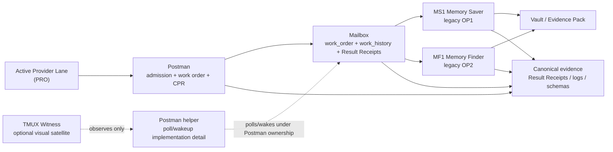
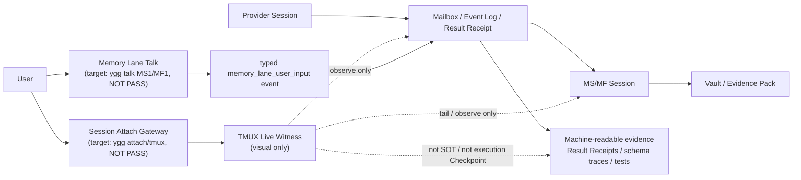

<p align="center">
  <h1 align="center">🌳 openyggdrasil</h1>
  <p align="center">
    <strong>A provider-neutral memory engine for AI coding agents</strong>
  </p>
  <p align="center">
    <em>A persistent, lifecycle-aware knowledge layer<br/>
    that compounds across providers — inspired by
    <a href="https://gist.github.com/karpathy/442a6bf555914893e9891c11519de94f">Karpathy's LLM Wiki</a>.</em>
  </p>
  <p align="center">
    English · <a href="./README.ko.md">한국어</a>
  </p>
</p>

<p align="center">
  <a href="#why">Why</a> •
  <a href="#how-it-works">How</a> •
  <a href="#modules">Modules</a> •
  <a href="#reasoning-lease">Reasoning Lease</a> •
  <a href="#setup">Setup</a> •
  <a href="#inspirations">Inspirations</a>
</p>

## First Contact: read this before installing or judging the project

openyggdrasil is a local, provider-neutral memory layer for AI coding agents. It is meant to help an agent preserve, retrieve, and revise durable project knowledge across sessions and providers without dumping raw chat transcripts into memory.

This top section is repo-native guidance for first contact. Do not assume the user already installed a local Hermes skill, a global `ygg` command, or any OpenYggdrasil runtime state.

Canonical terminology used by this README:

```text
Provider Unit N = PRO N + MS N + MF N
PRO N = Provider Lane N
MS N  = Memory Saver N  = legacy OP(2N - 1)
MF N  = Memory Finder N = legacy OP(2N)
Postman = delivery admission / work order / heartbeat / receipt mirror owner
Work Order = postman_work_order.v1
Work History = worker_work_history.v1
Worker Structured Receipt = worker_structured_receipt.v1
Status Brief = internal CPR/worker_brief
Evidence Pack = internal support_bundle
Result Receipt = internal receipt/query_receipt
Save Request = internal MemoryTicket/save intent
Find Request = internal recall query
Checkpoint = internal gate/proof/POC
```

Legacy `OP`, `producer`, `consumer`, and `operator` names can still appear where the README references runtime schemas, file paths, code modules, or historical compatibility ids. They are not the primary user-facing role names. Postman is not the semantic quality owner; it owns delivery admission, work orders, heartbeat/CPR, and receipt/history coordination.

Use this when:
- You are seeing this repository for the first time.
- A user gives you only the repository URL or path.
- A user asks whether this can be installed or tried locally.
- You need to decide what to read before running commands.

Do not use this when:
- You are trying to claim production readiness, Full UX PASS, multi-provider parity, or completion metrics.
- You are trying to infer live MS1/MF1 behavior from files, tests, Result Receipts, or README prose alone.
- You are about to create extra memory workers, background sessions, or global commands without explicit user approval.

If ambiguous:
- Treat a URL-only request as orientation, not a code review.
- Explain the repository purpose in a few sentences first.
- For installability, check only local prerequisites, documented install surfaces, dependency resolution, and the smallest documented smoke or healthcheck.
- Do not run broad archaeology, LOC inventory, full architecture review, or completion-state promotion unless the user asks for it.

First install path:
1. Start from the setup section below.
2. Verify local prerequisites before installing anything.
3. Ask before installing packages or system dependencies.
4. After setup, use the repository-provided contracts and runtime evidence, not assumptions from a previous local environment.

Typed unavailable when:
- The repository has not been cloned or the working directory is unknown.
- Required local prerequisites are missing and the user has not approved installation.
- A requested live Provider Unit claim cannot be observed in a user-visible live lane.
- A requested source, Result Receipt, or Vault node cannot be resolved to concrete evidence.

Required evidence refs:
- Static documentation claims need file paths and line references.
- Runtime claims need command output or test results.
- Provider Unit workflow claims need mailbox/Result Receipt/event-log evidence.
- Live UX claims need user-observable tmux/live-lane evidence in addition to machine-readable evidence.

Hard nonclaims:
- This repository is not declared production-ready here.
- The top README is not a PASS certificate.
- A completion table, plan, test count, or Result Receipt does not by itself prove Full UX PASS.
- Hermes-specific evidence does not automatically prove provider-neutral behavior.
- `ygg`, MS1/MF1 (legacy OP1/OP2), attach, and talk commands must not be assumed to exist before setup verifies them.

<a id="why"></a>

## Why This Exists
Every AI coding tool — Hermes, Codex, Claude Code, Cursor, Gemini CLI — has its
own way of "remembering" things. The common result:

| Problem | What happens |
|---|---|
| **Scattered decisions** | Useful context is trapped in provider chats, markdown notes, local files |
| **Stale memory** | Old decisions stay searchable long after they were superseded |
| **Provider lock-in** | Each tool invents a different memory format |
| **Transcript dumps** | Raw sessions leak into repos as "memory" |
| **No provenance** | Retrieval returns plausible context but can't prove source, freshness, or lifecycle state |

**RAG doesn't fix this.** RAG re-derives knowledge from scratch on every query.
There's no accumulation, no lifecycle, no cross-provider sharing.

> **The Fundamental Difference — When You Pay the Cognitive Cost:**
> - **RAG (Read-time):** Raw text → chunk → embed → Vector DB. Similarity search **at query time**. Retrieval quality is bounded by **ingestion quality**. If what you stored is unstructured, no embedding model can make the search results structured.
> - **openyggdrasil (Write-time):** Provider Lane delegates a Save Request → Memory Saver processes it at write time: extract → evaluate → place → save into structured Vault. Search operates on **pre-structured knowledge**.
>
> In Karpathy's analogy: RAG greps raw source code every time. openyggdrasil runs a **pre-compiled binary**.

**Vector databases don't fix this either.** They add infrastructure dependency
(Neo4j, Pinecone, embeddings) without solving the fundamental problem: *who
decides what to remember, what to forget, and what to deliver?*

openyggdrasil takes a different approach.

### 🛡️ 3-Tier Vector Replacement Strategy
Instead of using heavy vector databases or ElasticSearch, openyggdrasil achieves 10x token efficiency through a 3-tier deterministic filtering pipeline on a pure local file system:

1. **L1 Structural Filtering (YAML Frontmatter)**: Filters out stale knowledge (`SUPERSEDED`) before retrieval, addressing a common weakness of vector similarity searches. It uses frontmatter metadata (`status`, `tags`, `type`) for deterministic pre-filtering.
2. **L2 Topological Navigation (NetworkX)**: Traces explicit causality instead of probabilistic similarity. It converts `Sources` links between documents into a NetworkX graph, and uses the Louvain community algorithm to identify topic clusters that should be considered together.
3. **L3 Programmatic Scanning (PTC Full-text)**: Reduces token waste caused by carelessly shoving 10-20 candidates into the LLM's context window. A Python script (PTC) scans files in the background and returns refined conclusions (variable names, code snippets) to the agent. The goal is to reduce **"Lost in the Middle"** failure modes and round-trip token overhead.

### Cross-Provider Pollination

openyggdrasil functions as a shared knowledge repository that is not locked into any specific tool.

- **Agent A writes:** In a session with Agent A (e.g., Cursor), you decide on an architecture and it gets recorded in the Vault. (Source: `provider_id: cursor`)
- **Agent B reads and updates:** Days later, you open Agent B (e.g., Claude Code). It searches for, reads the document Agent A wrote, and continues the work. If the decision changes, Agent B pushes the old knowledge to `SUPERSEDED` and writes the new knowledge.
- **Agent A recognizes it again:** The next time Agent A connects, it doesn't read the stale knowledge it wrote in the past, but the updated knowledge maintained by Agent B.

This is possible because all agents abandon their internal transcript formats and share the same canonical Vault specification—the **strict frontmatter schema (Markdown + YAML)** of openyggdrasil.

## Core Philosophy

openyggdrasil fuses four core philosophies to prevent "memory erosion" in a fragmented multi-agent environment.

### 1. Persistent Knowledge Base (LLM Wiki)
Inspired by Andrej Karpathy's [LLM Wiki](https://gist.github.com/karpathy/442a6bf555914893e9891c11519de94f). Instead of injecting context via RAG on every query, openyggdrasil structures memory candidates emitted from provider sessions into **SOT candidates accumulated in a Markdown Vault**. In the current code, production starts from three raw inputs.

| Raw input | Code entrypoint | Structuring role |
|---|---|---|
| Shallow provider signal | `runtime/capture/session_structure_signal.py::build_session_structure_signal` | Carries `provider_id`, `provider_session_id`, `turn_range`, `surface_reason`, and `source_ref`; it does not carry the whole raw transcript. |
| Mailbox write request | `runtime/operator/producer.py::run_producer` | Reads `save`, `memory_ticket`, `prune`, `curate`, `sandbox-exec`, and `promote` intents from `mailbox/intents.jsonl` or legacy `messages.jsonl`. |
| Mailbox retrieval request | `runtime/operator/consumer.py::run_consumer` | Reads `query_text` from `mailbox/queries.jsonl` and builds Evidence Packs from the Vault. |

The normal write path uses `payload.context_snapshot` as its source material. That text is split by `extract_decisions()` into candidate decision/policy/fact/architecture sentences, converted by `build_spo_triples()` into `Subject / Predicate / Object` triples, wrapped by `build_vault_node()` as an `N-<content_hash>` node, passed through the Admission Checkpoint, and finally written by `save_to_vault()` as Markdown.

```text
Mailbox intent
  -> context_snapshot
  -> decision candidates
  -> S-P-O triples
  -> Vault node dict
  -> admission checkpoint
  -> Markdown file + Result Receipt
```

### 2. Domain Separation = Defining Continents (Continents & Terrain)
In openyggdrasil, a category is not just a folder; it is the **knowledge domain (Continent)** where SOT material is planted. The current physical continents are `concepts/`, `entities/`, and `comparisons/`. `runtime/ptc/primitives.py::save_to_vault()` calls `_classify_continent()` to choose the storage location from SPO content.

| Current physical continent | Data stored there | Current routing rule |
|---|---|---|
| `vault/concepts/N-*.md` | Decisions, policies, architecture, general concepts | Default route; `decision`, `policy`, and `architecture` land here. |
| `vault/entities/N-*.md` | Products, tools, companies, frameworks, named entities | `_classify_continent()` routes here when it sees entity markers. |
| `vault/comparisons/N-*.md` | Comparisons, contrasts, tradeoffs | Comparison markers route here. |
| `vault/queries/*.md` | Canonical topic / provenance ring pages | Created by the `memory_ticket` path. |
| `vault/_meta/provenance/*.md` | Episode/claim/ring provenance records | Source records for ring Evidence Packs. |
| `vault/communities/*.md` | Community placement hints | Auxiliary grouping for community id and related rings/topics. |

In naming terms, Amundsen owns continent boundaries, Map Maker owns topic/community/edge coordinates, and Gardener owns physical planting and lifecycle hygiene. In the current public runtime, these are not all fully independent LLM-module PASS surfaces; they are implemented as a mix of deterministic, stub, and POC paths across `primitives.py`, `producer.py`, `cultivation/*`, and `placement/*`.

Vault Markdown nodes are written with this shape:

```text
---
title: "<subject>"
created: YYYY-MM-DD
updated: YYYY-MM-DD
type: concept | entity | comparison
status: ACTIVE
tags: [<raw_category>, <predicate>]
sources: []
node_id: "N-..."
content_hash: "..."
---

# <subject>

## S-P-O Triple
- Subject: ...
- Predicate: ...
- Object: ...

## Source
> source sentence

## Metadata
provider_id and related metadata
```

### 3. Provenance Tracking and Lineage (Tree Rings & Evolution)
If a system merely overwrites files with the latest data, foundational context disappears. openyggdrasil therefore keeps two lineage surfaces.

First, regular Vault nodes carry `provider_id`, `created_at`, `content_hash`, and `node_id`. When a new node overlaps existing nodes, `assign_edges()` appends relationships to `_edges.jsonl`. The current edge ontology is:

```text
DEPENDS_ON
SUPERSEDES
CONTRADICTS
EXTENDS
IMPLEMENTS
RELATED_TO
```

The consumer path uses `_boost_by_edges()` to remove `SUPERSEDES` targets from default retrieval. That is the practical lifecycle behavior: old branches are not the preferred retrieval surface.

Second, the `memory_ticket` path creates a stronger Tree Ring structure. `runtime/operator/producer.py::_handle_memory_ticket()` resolves `source_ref` through `runtime/source_ref/registry.py::resolve_source_ref()`. The registry boundary is provider-neutral, but the currently implemented public resolver is the `hermes-session-json://` adapter. When resolution succeeds, the path writes:

```text
vault/queries/<topic>.md
vault/concepts/PRN-<hash>.md
vault/concepts/N-<hash>.md        # legacy search mirror
vault/_meta/provenance/<topic>.md
vault/communities/<community>.md
```

The raw data here is not a copied transcript. It is `source_ref`, `message_index_range`, `anchor_hash`, `decision`, and `surface_reason`: pointers and hashes engraved into the ring so the origin can be checked without dumping provider-private text into the Vault.

### 4. Structural Relationship Network (Graphify Topology)
Safi Shamsi's [Graphify (v5)](https://github.com/safishamsi/graphify) concept is used only as a **derived topology layer** for navigation. Graphify raw input is not provider session text; it is canonical Markdown that has already been promoted into the Vault.

`common/graphify/graphify-corpus.manifest.json` currently allows:

```text
SCHEMA.md
index.md
log.md
queries/*.md
concepts/*.md
entities/*.md
comparisons/*.md
_meta/provenance/*.md
```

The derived flow is:

```text
common/graphify/stage_graphify_input.py
  -> copies only canonical Vault Markdown into sandbox input

common/graphify/run_graphify_pipeline.py
  -> graphify.detect
  -> graphify.extract
  -> Hermes semantic extraction for document nodes
  -> graphify.build
  -> graphify.cluster
  -> graphify.report / graph.json / graph.html / summary.json

runtime/retrieval/graphify_snapshot_adapter.py
  -> wraps graphify-out as a non_sot snapshot

runtime/retrieval/graph_query_support_bundle.py
  -> turns graph hints into Evidence Pack candidates and requires SOT/provenance verification
```

Graphify outputs such as `graph.json`, `summary.json`, `GRAPH_REPORT.md`, and `graph.html` are navigation artifacts. They do not write the Vault, and providers must not answer from Graphify alone. If Graphify is unavailable, retrieval quality may degrade, but core capture, lifecycle, and mailbox delivery must continue.

---

> *"The wiki becomes richer with every source added. A human's job is to curate the sources and ask good questions. The LLM's job is everything else."* — Karpathy

Through this **'Construction of a Knowledge Ecosystem and Topological Fusion'**, openyggdrasil operates beyond a simple collection of texts—it acts as a **pure-local offline multi-agent memory system** that natively understands relationship networks without relying on external Vector DBs.

### The Bridge — Vault and Graphify

The system strictly isolates static file storage (Vault) from the dynamic relationship network (Graphify).

```text
┌────────────────────────────────────────┐
│  Graphify (Derived Topology / Non-SOT) │
│  [Math Nodes] ──(Edges)── [Clusters]   │  <-- Can be deleted and regenerated anytime
└─────────────────▲──────────────────────┘
                  │ (Real-time extraction & validation)
        [ skill_frontmatter_parser.py ]
                  │
┌─────────────────▼──────────────────────┐
│  Vault (Single Source of Truth / SOT)  │
│  ├── concepts/   (--- YAML ---)        │  <-- Immutable Markdown files
│  └── entities/   (--- YAML ---)        │
└────────────────────────────────────────┘
```

#### Vault: The Canonical Memory Surface

The Vault is the single source of truth (SOT). Knowledge produced by providers is ultimately recorded in the Vault, following this structure:

```
vault/
├── SCHEMA.md           # This schema file
├── index.md            # Master topic catalog (Karpathy's index.md)
├── log.md              # Chronological record (Karpathy's log.md)
├── concepts/           # Technical ideas, patterns, principles, recurring themes
├── entities/           # People, organizations, products, models, systems
├── comparisons/        # Side-by-side analysis, decision tradeoffs
├── queries/            # High-value answers with high derivation cost
├── _meta/              # Operational notes, templates, maps, governance
│   └── provenance/     # Provenance tracking records
└── raw/                # Original supporting materials (not raw transcripts)
```

**Frontmatter of each page:**

```yaml
---
title: Page Title
created: 2026-04-30
updated: 2026-04-30
type: entity | concept | comparison | query | summary
status: ACTIVE | SUPERSEDED
tags: [classification tags]
sources: [source refs or public paths]
---
```

<a id="setup"></a>

## System Requirements & Setup

openyggdrasil is designed to operate as a session-scoped skill attached to your AI provider (e.g., Hermes, Claude Code, Cursor). The target operating model does not require an always-on system-level server or separate server management. It may create session-scoped Postman helpers and MS/MF workers around the active Provider Lane. Postman owns delivery admission, work orders, wakeup routing, and receipt/history coordination; debug monitors must not become product owners. This is not a production-ready guarantee yet.

> **⚠️ Reasoning Lease Model (Asynchronous Multiplexing):**
> openyggdrasil does not have its own API keys, and it must not extract provider credentials.
> In the target non-blocking path, a Memory Saver/Finder worker may run behind the user chat only through an explicit, user-authorized Provider Unit task contract. A provider adapter may satisfy that contract through scoped delegation or asynchronous task-contract multiplexing, but the common boundary must remain provider-neutral. This boundary is not a production-ready claim.

### 1. How Providers Recognize openyggdrasil

Providers attach to openyggdrasil by reading the **`SKILL.md`** manifest at the repository root. To initiate the connection:
- Point your agent's skill configuration to the absolute path of `SKILL.md`.
- The agent reads this contract, which defines the declared entrypoints, command shapes, and boundaries for memory retrieval and capture.

Provider-first cold-start rule:

- The user first opens a normal provider session through that provider's native UX.
- The provider then receives the openyggdrasil repository path, URL, or skill reference and reads `SKILL.md`.
- A first-install environment must not assume a global `ygg` command already exists. The repository-local CLI is `./scripts/ygg` after checkout.
- If a `ygg-*` attach wrapper, legacy `oy-*` wrapper, or preinstalled `ygg` command is already globally visible before bootstrap, treat it as local/dev residue unless it is validated against a session-group health record.
- Repository-local tooling is a bootstrap asset discovered after the provider recognizes the repository. It is not evidence that a provider session is already attached.
- `ygg pro1` is not a universal first entrypoint and not a provider identity. It is a local Provider Lane attach/witness command after openyggdrasil has been recognized. Its internal tmux session name may be `ygg-pro1`.

Active session health is group-based, not lane-based:

```text
User command   Internal tmux   Runtime evidence
ygg pro1       ygg-pro1            provider_lane.v1
ygg ms1        ygg-ms1          MS1 Memory Saver registry/mailbox/work_order/native worker (legacy OP1 evidence id may appear)
ygg mf1        ygg-mf1          MF1 Memory Finder registry/mailbox/work_order/native worker (legacy OP2 evidence id may appear)
Canonical evidence            mailbox work_order/history / Result Receipts / event logs / attachment artifacts
```

If any side of that group is stale, the whole group is degraded. Implementations must not create fallback lanes such as `oy-2`, `oy-3`, or extra MS/MF pairs as an automatic response to uncertainty. A new Provider Unit MS/MF pair must be explicitly created and rebound.

### 2. System Requirements & Dependency Installation

openyggdrasil runs purely locally. The core runtime relies mostly on the Python Standard Library; optional Graphify-derived views and sandbox isolation require the following dependency stack:

**Supported Operating Systems:**
- **Linux / WSL2 Focus**: openyggdrasil's core Reasoning Lease Sandbox depends on `bubblewrap` for unprivileged Linux container isolation.
  - **Note (Cross-OS Execution):** While it is physically possible to call openyggdrasil inside WSL2 from a provider running natively on Windows (Cross-border Tunneling), it is **strongly discouraged**. This is due to the extreme complexity of Windows-WSL2 path translation, severe I/O performance degradation (via 9P protocol), and a high risk of deadlocks caused by Stdin/Stdout encoding differences. For stable operation, we highly recommend running the AI provider directly within the same WSL2 environment.

**Core Prerequisite:**
- **`Python 3.10+`**: Must be installed and accessible in the local environment.

**Python Packages (via pip):**
- **`graphifyy`**: Official Graphify package from <https://github.com/safishamsi/graphify>. Before installation, check the current PyPI version (`python -m pip index versions graphifyy`) and install/upgrade from PyPI (`python -m pip install -U graphifyy` or `python -m pip install -U -r requirements.txt`). The CLI/import surface is `graphify`.
- **`networkx`**: for graph derivation, node indexing, traversal, and Louvain community detection
- **`jsonschema`**: for strictly validating provider contracts and mailbox schemas
- **`pyyaml`**: for reading/writing configuration and manifest files
- **`rank-bm25`**: for Pathfinder's local BM25 keyword retrieval
- **`pytest`**: for local contract verification and smoke tests
- **`kiwipiepy`**: for Korean morphological analysis and sentence splitting

**System Dependencies:**
- **`bubblewrap`** (`bwrap`): required for unprivileged sandbox isolation during Reasoning Lease execution (Linux/WSL only).
- **`socat`**: required for WSL2/Linux provider-worker live/sandbox readiness and Unix socket/stream bridge checks.

**These dependencies must be installed in the user's local environment.**

> **⚠️ Mandatory Rule for Providers:**
> Before executing the initial setup (Cold Start) skill for the first time, the provider **MUST ask the user for explicit permission** to install these dependencies.
>
> 1. Provider detects that dependencies are missing.
> 2. Provider halts and prompts the user: *"openyggdrasil requires local Python packages and WSL2/Linux system dependencies. Do you allow installation or verification?"*
> 3. Only upon user approval, the provider installs or verifies the dependencies. **Silent or unprompted installations are strictly forbidden.**

### 3. Session-Scoped Cold Start

Once dependencies are approved and installed, the provider can execute the skill entrypoints defined in `SKILL.md`. The openyggdrasil runtime **cold-starts per Provider Session**. There are no system-level background daemons, but Memory Saver/Finder sessions bound to a Provider Lane may persist via Mailbox polling for the session's lifetime. They exit cleanly on timeout or Provider Session termination.

A clean cold start means:

- no pre-attached Provider lane is assumed;
- no global `ygg-*` attach wrapper or legacy `oy-*` command is required;
- no previous MS/MF registry pair is trusted without health evidence;
- no previous Vault proof artifact is treated as current runtime state;
- the provider must discover and validate the workspace before advertising an attach/witness lane.

### 4. Satellite Operating Model

openyggdrasil uses a **satellite model**, not a server model.

The active Provider Session is the center. Postman, Mailbox, Memory Saver, Memory Finder, and optional TMUX/debug panes are satellites that orbit that session. They exist to support the active Provider Session and must not become independent always-on services. Postman is a delivery owner, not a separate semantic judge.

```text
Provider Unit
  ├─ PRO Provider Lane            active user-facing provider session
  ├─ MS1 Memory Saver satellite   session-scoped background save worker (legacy OP1)
  ├─ MF1 Memory Finder satellite  session-scoped background find worker (legacy OP2)
  ├─ Postman satellite            delivery admission / work_order / CPR / receipt mirror owner
  ├─ Mailbox satellite            local file queue / work_history / Result Receipt ledger
  ├─ Postman helper               poll/wakeup implementation detail under Postman ownership
  └─ TMUX witness satellite       optional human visual surface
```

What each satellite is:

| Satellite | What it is | What it is not |
|---|---|---|
| Postman | Delivery admission, work orders/history, MS/MF heartbeat/CPR, receipt mirroring | Semantic quality owner, independent reasoning worker |
| Mailbox | Local file-based queue and Result Receipt ledger | Server, socket API, public service |
| Postman helper | Implementation detail that polls the mailbox or wakes the native pane under Postman ownership | Product owner, canonical input lane, global server |
| MS1 Memory Saver | Background save worker bound to a Provider Unit (legacy OP1) | Standalone memory server |
| MF1 Memory Finder | Background find worker bound to a Provider Unit (legacy OP2) | Standalone search server |
| TMUX witness | Optional human inspection surface | SOT, execution Checkpoint, canonical input lane |

Satellite lifecycle rules:

- satellites must be created only after the provider has recognized the workspace;
- satellites must be attached to one active Provider Unit session group;
- stale satellites degrade the whole group;
- cleanup must be explicit and backup-first;
- uncertainty must not create fallback satellites such as `oy-2`, `oy-3`, or extra MS/MF pairs;
- canonical evidence remains mailbox work_order/history, Result Receipts, event logs, schema traces, and attachment artifacts.



Hard nonclaim: "no server" means no always-on system-level openyggdrasil service is required. It does **not** mean there are never background processes. Session-scoped satellite workers may exist, but they must be lifecycle-bound, healthchecked, and cleanup-verifiable.

### 5. TMUX Live Witness Policy

TMUX is an optional **live witness surface** for humans. It exists so a user can visually inspect the decision flow across Provider Lanes and Memory Saver/Finder sessions while a live verification run is in progress.

TMUX is **not** the core execution path. The default operating mode remains background-first:

- Provider Lane and Memory Saver/Finder sessions run through the Mailbox, Result Receipts, event logs, and provider-owned background tasks.
- Memory Saver/Finder work must continue even when no TMUX pane is attached.
- TMUX panes may tail the same logs, inboxes, Result Receipts, or status snapshots that the background runtime already produces.
- Closing or failing a TMUX pane is an observability loss, not a memory-engine failure.
- A TMUX capture may be used as human-readable evidence, but it must not replace machine-readable Result Receipts, schema-valid traces, or test results.



TMUX affordance contract:

```text
Use this when: a human needs to visually follow Provider Unit flow during live verification.
Do not use this when: you need canonical proof that background work, memory write, or retrieval succeeded.
If ambiguous: inspect Result Receipts, event logs, and schema traces first; treat TMUX as an auxiliary screen.
Typed unavailable when: tmux is missing or pane attach fails while background Result Receipts are still healthy -> `tmux_visual_witness_unavailable`.
Required evidence refs: Mailbox Result Receipt, event log, schema-valid trace, test result.
Hard nonclaims: TMUX is not SOT, and raw stdin/tmux injection is not the canonical Memory Lane Talk input.
```

Current manual TMUX witness setup:

```bash
# Check tmux on WSL / Linux
tmux -V

# If tmux is missing on Ubuntu / WSL, install it explicitly
sudo apt-get update
sudo apt-get install -y tmux

# Point tmux at the openyggdrasil project and one Memory Saver mailbox
PROJECT=/path/to/openyggdrasil
LANE=MS1
OP=OP1  # internal legacy mailbox id for MS1
SESSION=openyggdrasil-witness
MAILBOX="$HOME/.yggdrasil/sessions/$OP"
VAULT="$PROJECT/vault"

# Prepare observer directories. This does not create a memory job.
mkdir -p "$MAILBOX" "$VAULT"

# Create the witness session
tmux new-session -d -s "$SESSION" -c "$PROJECT"
tmux rename-window -t "$SESSION:0" witness

# Pane 0: observe mailbox Result Receipts/status
tmux send-keys -t "$SESSION:0.0" \
  "watch -n 1 'printf \"mailbox: $MAILBOX\\n\\n\"; ls -lah \"$MAILBOX\"; printf \"\\nreceipts\\n\"; tail -n 20 \"$MAILBOX\"/receipts.jsonl 2>/dev/null; printf \"\\nquery_receipts\\n\"; tail -n 20 \"$MAILBOX\"/query_receipts.jsonl 2>/dev/null'" C-m

# Pane 1: observe intent/query input logs
tmux split-window -h -t "$SESSION:0" -c "$PROJECT" \
  "tail -F \"$MAILBOX\"/intents.jsonl \"$MAILBOX\"/queries.jsonl 2>/dev/null"

# Pane 2: observe Vault file changes
tmux split-window -v -t "$SESSION:0.1" -c "$PROJECT" \
  "watch -n 2 'find \"$VAULT\" -maxdepth 2 -type f | sort | tail -n 40'"

tmux select-layout -t "$SESSION:0" tiled

# Attach in the foreground
tmux attach -t "$SESSION"
```

Operational commands:

```bash
tmux ls                         # list running witness sessions
tmux attach -t openyggdrasil-witness
tmux detach-client -s openyggdrasil-witness  # or Ctrl-b d from the attached screen
tmux kill-session -t openyggdrasil-witness
```

Repository-local attach/witness UX is now implemented for the Provider Unit 1
lifecycle surface. In the public repository, run it as `./scripts/ygg` unless a
separate install gate has validated a global `ygg` shim. Do not assume global
`ygg`, `ygg-*`, or legacy `oy-*` commands are preinstalled. The user-facing
command surface is `ygg`; `ygg-*` names are internal tmux lane names, not
first-install requirements:

```text
./scripts/ygg doctor  # repo-local session-group healthcheck
./scripts/ygg status  # repo-local live witness status
./scripts/ygg pro1    # Provider attach/witness command; internal tmux: ygg-pro1
./scripts/ygg ms1     # Memory Saver MS1 attach/witness command; internal tmux: ygg-ms1
./scripts/ygg mf1     # Memory Finder MF1 attach/witness command; internal tmux: ygg-mf1
ygg talk MS1          # target, NOT PASS; must become a typed event, not raw tmux/stdin input
```

Note: the manual tmux commands above only launch observer panes. Sending user judgment requests or Memory Lane Talk payloads through `tmux send-keys` is not canonical input and cannot be marked PASS evidence.

Status terms must stay precise:

| Status | Meaning |
|---|---|
| `background_task_passed` | The provider/operator work completed through the normal background path. |
| `tmux_visual_witness_available` | A human can inspect the live flow in TMUX. |
| `tmux_visual_witness_unavailable` | The visual witness is unavailable; the background path may still be healthy. |
| `foreground_equivalent` | The system was verified through background logs/Result Receipts, not a true live foreground surface. |
| `live_foreground_claimed` | Allowed only when an actual foreground/live provider surface was verified. |

Provider adapters may implement TMUX dashboards differently, but they must not make TMUX a hard dependency of the provider-neutral runtime.

### Verify Installation Manually

If you prefer to verify the installation before attaching a provider:

```bash
# Clone the repository
git clone https://github.com/INTEGRITY2077/openyggdrasil.git
cd openyggdrasil

# Install dependencies (user-initiated)
pip install -r requirements.txt

# WSL2/Ubuntu system dependencies (user-initiated)
sudo apt-get install -y bubblewrap socat

# Run import smoke test
python runtime/import_smoke.py
```


**Actual Codebase Implementation (Frontmatter Parser):**
The codebase includes `runtime/retrieval/skill_frontmatter_parser.py` to extract `---` YAML frontmatter from markdown files and validate it against a JSON Schema contract. Graphify and Pathfinder should rely on this parsed topological data before treating relationships as support evidence.

**Vault Promotion Rules — To be recorded:**
- Must be persistent, non-trivial, hard to re-derive, and reusable in future sessions.
- Transient conversations, trivial responses, and raw session dumps are strictly prohibited.

#### Graphify: The Derived Visibility Layer

This is a **derived layer** that builds graph/wiki/index views over the Vault.
**Graphify failure should not block the core capture, lifecycle, or Mailbox path; this remains a support-verification gate, not a production-ready claim.**

**Why adopt Graphify:**

| Problem | Graphify's Solution |
|---|---|
| Unnavigable as Vault pages pile up | Visualizes relationships as a node/edge graph |
| "Where does this concept connect?" | Automatically detects topic clusters via NetworkX Louvain community detection |
| Lack of structural context in search | Identifies core hubs via God Node and Surprising Connection analysis |
| Dependency on external infra (Vector DBs) | Pure Python + NetworkX, runs locally offline |

**Graphify Derived Pipeline:**

```
  Vault (Canonical Memory)
       │
       │  stage_graphify_input.py
       │  → Stages promoted Vault pages into the input corpus
       │
       ▼
  ┌─ Graphify 7-Step Pipeline ───────────────────────────────┐
  │                                                          │
  │  detect    → Detects corpus files                        │
  │  extract   → Extracts AST/structure                      │
  │  semantic  → Extracts semantic relations (uses tokens)   │
  │  build     → Builds NetworkX graph                       │
  │  cluster   → NetworkX Louvain community detection        │
  │  analyze   → God Node, Surprising Connection analysis    │
  │  report    → GRAPH_REPORT.md + graph.json + graph.html   │
  │                                                          │
  └──────────────────────────────────────────────────────────┘
       │
       ▼
  Derived Artifacts (Not SOT):
  ├── GRAPH_REPORT.md    # Analysis report
  ├── graph.json         # Machine-readable graph
  ├── graph.html         # Visual exploration interface
  └── summary.json       # Node/edge/community summary
```

**Core Boundary:**

```
  ┌───────────────────────────────────────────────────────┐
  │  Vault (SOT)                                          │
  │  • Canonical memory — the only Source of Truth        │
  │  • Lifecycle state (ACTIVE / SUPERSEDED / STALE)      │
  │  • Provenance tracking (source_ref, origin_locator)   │
  │  • Enforced frontmatter schema                        │
  └────────────────────┬──────────────────────────────────┘
                       │ Derivation (One-way)
                       ▼
  ┌───────────────────────────────────────────────────────┐
  │  Graphify (Derived View)                               │
  │  • Graph/wiki/index — Visibility layer                 │
  │  • Failure does not block the core pipeline            │
  │  • Provides hints to Pathfinder (verification required)│
  │  • Never mutates the Vault (Read-only)                 │
  └───────────────────────────────────────────────────────┘
```

Graphify artifacts enhance Pathfinder's retrieval quality, but
**Pathfinder must cross-verify Graphify hints against the original Vault before treating them as support evidence.**
If a relationship suggested by Graphify cannot be verified in the Vault, it must be treated as an untrusted hint rather than SOT.

---

<a id="how-it-works"></a>

## System Architecture

### Provider Unit Memory Loop

Building on this philosophy, openyggdrasil treats memory as a **two-sided engine** — a **Production Side** that captures and curates knowledge, and a **Consumption Side** that retrieves and delivers it.

From the 9th North Star, background execution subjects are named **Memory Worker Sessions**. The term "Session" emphasizes that each subject has a clear start/end lifecycle and a 1:1 pairing relationship with a Provider Lane.
The Memory Worker Session runs in **physically separated independent background processes** following the **CQRS (Command Query Responsibility Segregation)** principle, communicating with the Provider Lane only through the **Mailbox**.
```
  Provider Lane (e.g., Hermes)
  Detects decisions during user conversation
       │
       │  Emits Save Request / Find Request
       ▼
  ┌─────────────────────────────────────────────────────────┐
  │                    MAILBOX (JSONL)                       │
  │  (Sole communication channel between sessions)          │
  └────────────────┬───────────────────┬────────────────────┘
                   │  Save Request      │  Find Request
                   ▼                   ▼
  ┌───────────────────────────┐  ┌───────────────────────────┐
  │  Memory Saver Session│  │  Memory Finder Session│
  │  (Independent background) │  │  (Independent background) │
  │                           │  │                           │
  │  SKILL composes PTC       │  │  SKILL composes PTC       │
  │  primitives for S-P-O     │  │  primitives for Vault     │
  │  extraction + Vault write │  │  search + formatting      │
  └───────────┬───────────────┘  └───────────┬───────────────┘
              │                              │
              ▼                              ▼
  ┌───────────────────────────┐  ┌───────────────────────────┐
  │     VAULT (SOT)           │  │  Result Receipt / Evidence    │
  │  Saved nodes stored       │  │  → Mailbox → Provider Lane    │
  └───────────────────────────┘  └───────────────────────────┘
```

**Key constraint:** Memory Worker Sessions (Memory Saver/Finder; some runtime file names remain legacy producer/consumer compatibility paths) run in physically separate context windows (PIDs) from the Provider Session, with no shared memory.
Postman/Mailbox (JSONL filesystem) is the canonical work channel. Postman accepts, wakes, and records work, but it does not own semantic storage or recall quality. Existing Mock/Mailbox POC evidence is bounded proof; it does not prove all-provider same UX or production readiness.

#### Session Definitions

| Term | Definition | Physical Boundary |
|---|---|---|
| **Provider Session** | The PID of a provider's conversation window | User runs 3 Hermes instances → 3 independent Provider Sessions |
| **Memory Worker Session** | A background independent process spawned by the Provider Lane | Memory Saver and Memory Finder are each separate worker sessions (legacy CQRS operator sessions) |

**Scaling Model:** When N providers each summon operators, up to **N×2** Memory Worker Sessions exist simultaneously.

**Start Type Distinction:**

| Type | Meaning | When |
|---|---|---|
| **Cold Start (Setup)** | One-time. SKILL.md recognition, dependency installation, Vault initialization | After repo clone |
| **Session Start (Initial Summon)** | Provider worker summons an MS/MF worker for the first time today via SKILL | Provider session start |

**SKILL.md vs Mailbox Role Separation:**

| | SKILL.md | Mailbox |
|---|---|---|
| Nature | **Static** reminder | **Dynamic** state awareness channel |
| Role | Announces the memory worker's existence | Conveys the operator's current state |
| Limitation | Cannot tell current state | — |

SKILL alone cannot tell a provider "Is my operator alive? What has it processed?"
The **only channel** for a provider to be aware of its loosely-coupled memory worker's state is the Mailbox.
**Therefore, Mailbox Hygiene determines overall system health.**
### Production Side — "What to remember"

The production pipeline doesn't blindly store everything. It **distills**
provider signals into typed decision candidates, **evaluates** their worthiness,
**places** them in navigable topic structures, and **prunes** stale knowledge
through lifecycle transitions.

### Consumption Side — "What to deliver"

The consumption pipeline doesn't dump the entire vault. **Pathfinder** builds
explainable, lifecycle-aware, and **Provenance-tracked Bounded Evidence Packs**.

Rather than just raw text summaries, these bundles (governed by the `support_bundle.v1.schema.json` contract) structurally embed a **3-tier provenance tracking mechanism** that lets the agent trace back toward the original context:
1. **Breadcrumbs (`source_paths`)**: The array of URI paths to the original files where the knowledge was extracted.
2. **Topology IDs (`episode_ids`, `claim_ids`)**: The contextual topological coordinates within Vault/Graphify where this knowledge was generated.
3. **Evidence Refs (`safe_ref`)**: Safe pointers to supporting logs or terminal execution evidence when available, allowing the agent to inspect the less-compressed source context if needed.

Consequently, the agent receives both the distilled summary and bounded evidence addresses for origin inspection through **Postman-managed Mailbox / work_history / Result Receipt** contracts.


## PTC (Programmatic Tool Calling) Concept & Architecture

The production and consumption pipelines are being realigned around a **PTC (Programmatic Tool Calling)** architecture. Existing PTC IPC/sandbox/template paths are partial evidence; production/consumption kitchen split, typed egress, and sandbox fail-closed are still open gates.

**Source of Truth (SOT):**
This architecture is heavily inspired by Anthropic's [Programmatic Tool Calling](https://docs.anthropic.com/en/docs/agents-and-tools/tool-use/programmatic-tool-calling) (PTC) and the broader open-ended agentic loop (REPL) philosophy.

### Original Architecture (Claude PTC)

```
  ┌──────────────────────────────────────────────────────────────┐
  │          Anthropic Programmatic Tool Calling (PTC)           │
  │                                                              │
  │  1. Agent: Emits `server_tool_use` (name: code_execution)    │
  │  2. Sandbox: Starts executing Python script                  │
  │  3. Script: Calls `await target_tool()` internally           │
  │  4. API: Pauses Sandbox, emits `tool_use` to Host            │
  │     (payload: `caller: { type: code_execution_... }`)        │
  │  5. Host: Returns `tool_result`                              │
  │  6. Sandbox: Resumes execution, processes data (loops, etc.) │
  │  7. Sandbox: Emits `code_execution_tool_result`              │
  └──────────────────────────────┬───────────────────────────────┘
                                 │ Contract: allowed_callers=["code_execution..."]
                                 ▼
  ┌──────────────────────────────────────────────────────────────┐
  │                     Host (Client Tools)                      │
  │             (Database, File system, APIs, etc.)              │
  └──────────────────────────────────────────────────────────────┘
```

The standard PTC paradigm allows the agent to freely write Python code within a sandbox to control multiple tools:
1. The agent autonomously writes a Python script containing loops and conditional logic.
2. The script executes, calling multiple tools sequentially and filtering intermediate data, saving tokens and latency.
3. While efficient and flexible, normalizing knowledge into a strict lifecycle memory system using this approach is highly unpredictable. It relies entirely on the logical integrity of the agent's on-the-fly script, making it vulnerable to runtime hallucinations.

### openyggdrasil's PTC Transformation — 26-Tool Palette + IPC Callback Loop

```
  ┌──────────────────────────────────────────────────────────────┐
  │               openyggdrasil (PTC Palette)                    │
  │                                                              │
  │  1. Provider: ygg generates LLM code templates for MS1/MF1 (legacy OP1/OP2)   │
  │  2. Stub Generator: injects IPC preamble + 26 tool functions │
  │  3. Sandbox Executor: runs Python script in bwrap sandbox    │
  │  4. IPC Server: calls host primitives via Unix Domain Socket │
  │  5. Tool composition: template combines only allowed          │
  │     production/consumption tools for the current role         │
  │  6. Result: output returned from sandbox, recorded as Result Receipt │
  └──────────────────────────────┬───────────────────────────────┘
                                 │ Transport: Unix Domain Socket
                                 ▼
  ┌──────────────────────────────────────────────────────────────┐
  │      26 PTC Tool Palette (runtime/ptc/_preamble.py)          │
  │  SEARCH:  deep_search, search_vault                          │
  │  PROVENANCE: locate_region, select_topic_anchor,             │
  │    read_origin_claims, read_recent_claims, collect_claim_ids,│
  │    read_source_paths, assemble_support_bundle,               │
  │    assemble_unanchored_bundle                                │
  │  PRODUCTION: find_similar, suggest_placement,                │
  │    get_category_tree, check_conflicts                        │
  │  GRAPH: trace_evolution, get_community, rank_by_relevance    │
  │  CHAIN: extract_spo, create_edge, prune_node, validate_node  │
  │  CORE: get_all_nodes, get_node, save_note, get_edges         │
  └──────────────────────────────────────────────────────────────┘
```

### Target PTC Kitchen Split — Production/Consumption Tool Handles

The current implementation injects a mixed 26-tool surface from `_preamble.py` and dispatches it through a single `ipc_server.py` dispatcher. The table below is the **target allowlist**, not a current production-ready PASS claim. It is the P1 boundary that still needs runtime enforcement.

| Kitchen | Default job | Default allowed tools | Explicitly forbidden |
|---|---|---|---|
| Production Kitchen | Validate a new memory candidate and plant it into the Vault | `extract_spo`, `validate_node`, `find_similar`, `check_conflicts`, `suggest_placement`, `get_category_tree`, `save_note`, `create_edge`, `prune_node`, `result` | Acting like a consumption Evidence Pack surface; using raw stdout as provider-facing output |
| Consumption Kitchen | Search the existing Vault and return bounded evidence | `search_vault`, `deep_search`, `rank_by_relevance`, `locate_region`, `select_topic_anchor`, `read_origin_claims`, `read_recent_claims`, `collect_claim_ids`, `read_source_paths`, `assemble_support_bundle`, `assemble_unanchored_bundle`, `trace_evolution`, `get_community`, `get_node`, `get_edges`, `result` | Vault mutation such as `save_note`, `create_edge`, or `prune_node` |
| Common / Debug | Final result return and bounded inspection | `result`; `get_all_nodes` is limited to debug/admin surfaces | Pushing large raw Vault dumps into provider context |

The high-risk handles should read like this:

| Tool | Production side | Consumption side | Current status |
|---|---|---|---|
| `save_note` | Allowed | Forbidden | Not yet enforced by a runtime allowlist |
| `create_edge` | Allowed | Forbidden | Not yet enforced by a runtime allowlist |
| `prune_node` | Allowed | Forbidden | Not yet enforced by a runtime allowlist |
| `assemble_support_bundle` | Usually forbidden | Allowed | Internal tool that must produce a Provider-facing Evidence Pack |
| `search_vault` / `deep_search` | Bounded preflight only | Allowed | Needs role-specific affordance text and schema gates |
| `result` | Allowed | Allowed | Must be wrapped in typed egress; raw stdout is debug-only |

PTC Kitchen affordance contract:

```text
Use this when: a Memory Worker Session must compose multiple Vault tools inside a sandbox while keeping role responsibilities separate.
Do not use this when: all tools are mixed into one LLM surface that can freely cross mutation/read boundaries.
If ambiguous: writing memory or changing lifecycle goes to Production Kitchen; finding support for the user goes to Consumption Kitchen.
Typed unavailable when: role allowlist, typed egress, or sandbox fail-closed is not enforced by runtime.
Required evidence refs: `_preamble.py` tool list, `ipc_server.py` dispatcher, sandbox execution result, role allowlist test.
Hard nonclaims: the current PTC IPC/sandbox vertical slice is not full PTC chain PASS and not kitchen-split production readiness.
```

openyggdrasil's PTC model has moved from the legacy **Typed PTC Engine** (JSON Execution Plan, 8-Tool Chain) toward a 26-tool palette plus IPC callback loop:

1. **Tool Palette:** 8 tools → 26 across 6 groups (SEARCH, PROVENANCE, PRODUCTION, GRAPH, CHAIN, CORE). Each tool includes affordance-based descriptions (`Use this when` / `Do NOT use when`) in the preamble.
2. **IPC Callback Loop:** Python code running inside a bwrap sandbox calls host primitives via a Unix Domain Socket. production sandbox fail-closed and typed egress are still separate gates.
3. **Dual Path:** Memory Saver/Finder supports both a fixed chain (extract_decisions→build_vault_node→save_to_vault) and a PTC chain (`ygg tell --ptc ms1`). Dual path support itself is not a production-ready claim.
4. **LLM Free Composition (current state):** The 26-tool surface exists, but the current PTC production path is still close to the `extract_spo → suggest_placement → save_note` template. Safe role-scoped free composition inside kitchens is a P1 gate.
5. **P1 realignment required:** production(write/mutate) kitchen and consumption(read/search/support) kitchen must be split. Consumption surfaces must not expose `save_note`, `create_edge`, or `prune_node` as default handles.

### Background: Why PTC over Vector DBs / ElasticSearch? (Token Efficiency)

Traditional RAG (Retrieval-Augmented Generation) approaches rely on Vector DBs or ElasticSearch to retrieve massive amounts of documents, dumping thousands or tens of thousands of text tokens directly into the agent's context window. This is **expensive, slow, and causes "Lost in the middle" hallucinations**.

The primary reason openyggdrasil abandoned heavy external infrastructure in favor of a **pure local-filesystem PTC architecture** is its **overwhelming token efficiency and structural filtering**:

- **Context Exclusion of Intermediate Data:** When the agent calls utility tools like `scan_topology` or `filter_lifecycle`, massive amounts of intermediate data (e.g., scanning 20 Vault documents) should remain outside the agent's context window. The data is processed, filtered, and aggregated within Python memory before a typed result is returned.
- **Elimination of Model Round-Trip Overhead:** Querying 10 knowledge nodes as independent tools consumes massive tokens because it invokes the LLM individually for each query. By using PTC to read 10 documents within a single code execution block and returning only a summarized conclusion, token usage is reduced by approximately **10x or more**.
- **Returning Only the Final Summary:** The agent is shielded from the vast noise of the search process. It only receives the final, highly refined bounded Evidence Pack.


## Execution Model

openyggdrasil does not have its own LLM or API keys, and it must not extract
provider credentials or bypass provider billing, security, or terms.
When a provider (Hermes, Claude Code, Cursor, etc.) enters this repository,
it reads **`SKILL.md`** at the root and executes the entrypoints defined
there only inside the user's active, authorized provider session.

```
  Provider Lane
       │
       │  Enters repo → discovers SKILL.md
       │
       ▼
  ┌──────────────────────────────────────────────────┐
  │  SKILL.md (Contract)                              │
  │                                                  │
  │  "To capture, run this Python script"             │
  │  "To retrieve, call this entrypoint"              │
  │  "Input shape is X, output shape is Y"            │
  └──────────────────────────────────────────────────┘
       │
       ▼
  Agent runs Python entrypoints via its own shell/tool-use
  → Memory Saver/Finder runs the fixed chain through the worker pipeline
  → or PTC chain (`--ptc`) executes code from the 26-tool palette
```

Two capabilities may be used through the active provider session:

| Capability | Description |
|---|---|
| **Execution context** | The agent's shell/tool-calling ability to run Python scripts |
| **Reasoning capacity** | The provider session's model reasoning capability, used only through explicit task contracts and runtime guardrails |

**The Memory Worker Session is the intended pipeline execution subject.** Some utility paths run deterministically in pure Python, while decision-heavy guardrails require an explicit reasoning-lease boundary. This does not mean the full PTC kitchen is production-ready.

Independent API key configuration for self-hosted execution (without a
provider) is planned for the future.

---
## Operational Flow — Trigger to Delivery

The diagram above shows the internal chain, but the real question is:
**how does a provider actually invoke this system?**

There are two distinct invocation paths — one for **writing** knowledge
(Production Trigger) and one for **reading** it (Consumption Trigger).

```
  ┌─────────────────────────────────────────────────────────────────────────┐
  │              TARGET LIFECYCLE OVERVIEW (GATES STILL OPEN)               │
  │                                                                        │
  │  ① Provider Lane reads SKILL.md                                             │
  │  ② Provider adapter/worker decides: "capture" or "retrieve"            │
  │                                                                        │
  │  CAPTURE PATH (Production)                RETRIEVE PATH (Consumption)  │
  │  ─────────────────────────                ──────────────────────────── │
  │  ③ Agent calls capture entrypoint         ③ Agent calls retrieve       │
  │     with structured signal                   entrypoint with query     │
  │  ④ Signal → 12-module chain               ④ Pathfinder → Vault scan   │
  │  ⑤ Vault updated                          ⑤ Evidence Pack assembled  │
  │  ⑥ Postman → Mailbox work_history/Result Receipt ⑥ Mailbox → Agent receives  │
  │                                              bounded retrieval result  │
  └─────────────────────────────────────────────────────────────────────────┘
```

### Production Trigger — Context Recognition and Delegation (First-Pass)

Target UX: a Provider Lane or adapter should recognize when an architectural decision or debugging insight is **valuable enough to be recorded (wiki-fied)**. Current status does not claim Hermes-native automatic MemoryTicket hooks or provider natural async reflection are PASS.

When this need is explicitly detected or routed, the Provider Lane should avoid copy-pasting the entire heavy text block. Instead, it should consult `SKILL.md` to construct a lightweight `Session Structure Signal`. This signal acts as a shallow request, pairing a brief summary with bounded pointers to relevant evidence handles.

```
  Provider Lane (the user-facing PRO lane)
       │
       │  ① Identifies or receives a context worth wiki-fying
       │
       │  ② Reads SKILL.md to discover the entrypoint and rules
       │
       │  ③ Constructs the Session Structure Signal (Shallow Request):
       │     {
       │       provider_id:         "hermes"
       │       provider_session_id: "session-2026-04-30-abc123"
       │       trigger_type:        "hard_trigger"
       │       surface_reason:      "Decided to use gateway pattern..."
       │       turn_range:          { from: 12, to: 18 }
       │       source_ref:          { path_hint: "sessions/abc123.jsonl" } // evidence handle, not raw dump
       │     }
       │
       │  ④ Publishes Intent to Mailbox & spawns an MS/MF worker asynchronously (Fire-and-Forget)
       │     → Provider immediately returns to user chat (Non-blocking)
       │
       ▼
  Memory Worker Session (runs in background, receiving request via Mailbox)
```

**Key rules:**
- **Pointer-Based Delegation (`source_ref` is mandatory):** The Provider Lane must not mutate or unnecessarily duplicate raw conversations. It must pass a `source_ref` pointing to the relevant `.jsonl` log or evidence handle. Signals missing this pointer are rejected by the Admission Checkpoint.
- **Asynchronous Cold-Start (Non-blocking target):** openyggdrasil should not block the provider. The target path delegates through Mailbox/background execution and leaves a Result Receipt when the job is done; this is still bounded by provider adapter support and Result Receipt evidence.
- **Reasoning Lease:** The Memory Worker needs intelligence to perform deep structuring (Distill/Evaluate) in the background. The Provider adapter must expose an explicit reasoning-lease boundary, such as scoped auth delegation or asynchronous multiplexing of task contracts emitted by the background Memory Worker.


### Production Pipeline — CQRS Memory Saver/Finder + PTC Dual Path

> ⚠️ **15th realignment note:** PTC IPC/sandbox/template execution paths exist, but PTC production/consumption kitchen split, typed egress, and sandbox fail-closed are not closed. This section describes the current execution model and next gates; it is not a production-ready claim.

When a capture signal enters the system, it is not blindly handed off to an automated black box. This process is divided between the Provider Session and a dynamically leased Memory Worker Session:

1. **Initial Context Recognition (Provider Adapter / Worker)**: The provider adapter or worker reads `SKILL.md` to route contexts worth remembering. It should construct an initial signal (`Session Structure Signal` containing `surface_reason` and `source_ref`) and inject it into the OpenYggdrasil runtime only when evidence is available.
2. **Deep Structuring (Memory Worker Session)**: In the target flow, the runtime receives this request through the provider adapter's Reasoning Lease boundary and spawns a Memory Worker Session. This Memory Worker Session is **not** meant to be a fixed pipeline sequence. It is a **Role-Polymorphic Leased Executor** concept assigned specifically to knowledge production roles (Distiller, Evaluator, Amundsen, Gardener).

True to the nature of PTC, the Memory Worker Session can **execute template code inside a bwrap sandbox** for its Memory Saver/Finder role. The safe target is not to mix all 26 tools into one surface, but to split production and consumption kitchens and enforce role-specific allowlists plus typed egress.

The tools provided to the Memory Worker Session follow two execution paths:

1. **Contract Guardrails (Requires Reasoning)**: Consume the Memory Worker Session's reasoning tokens. The Memory Worker Session must make judgments (distillation, evaluation, classification), but the guardrails strictly enforce the JSON Schema output.
2. **Utility Tools (No Reasoning)**: Pure Python deterministic functions. The Memory Worker Session just passes the verified payload from the previous step to normalize, save, and package data.

```
  Session Structure Signal (Injected by Provider Lane)
       │
       ▼
  PTC Memory Worker Session (Role-Polymorphic Executor assigned to Knowledge Production)
       │
       │  ① OpenYggdrasil provides a Task Contract (Distiller/Amundsen/Gardener etc)
       │  ② Memory Worker Session invokes tools inside the role-specific kitchen
       │
       ▼
  ┌─ PTC Engine (Runtime) — Allowlisted Tool Pool ───────────────────────────┐
  │                                                                          │
  │  [Contract Guardrails — Structure Memory Worker Session's reasoning]          │
  │                                                                          │
  │  ┌─ distill_signal (Guardrail — Refers to Affordance Contract) ────────┐ │
  │  │  Deeply distill shallow signal into structural decisions            │ │
  │  │  Role: Guardrail (Consumes Memory Worker Session's reasoning)             │ │
  │  └─────────────────────────────────────────────────────────────────────┘ │
  │                                                  ▼                       │
  │  ┌─ evaluate_candidate (Guardrail) ────────────────────────────────────┐ │
  │  │  Judges promotion worthiness, dedupes, threshold gating             │ │
  │  │  Role: Guardrail (Consumes Memory Worker Session's reasoning)             │ │
  │  └─────────────────────────────────────────────────────────────────────┘ │
  │                                                  ▼                       │
  │  ┌─ classify_novelty (Guardrail) ──────────────────────────────────────┐ │
  │  │  Classifies category & new continent (novelty)                      │ │
  │  │  Role: Guardrail (Consumes Memory Worker Session's reasoning)             │ │
  │  └─────────────────────────────────────────────────────────────────────┘ │
  │                                                  ▼                       │
  │  [Utility Tools — Pure Python functions for packing & planting]          │
  │                                                                          │
  │  ┌─ stamp_provenance (Utility) ────────────────────────────────────────┐ │
  │  │  Engraves Tree Rings: stamps source_ref, origin_locator             │ │
  │  │  Role: Utility (Deterministic Python)                               │ │
  │  └─────────────────────────────────────────────────────────────────────┘ │
  │                                                  ▼                       │
  │  ┌─ compose_seed (Utility) ────────────────────────────────────────────┐ │
  │  │  Combines upstream outputs into the final engraved Seed             │ │
  │  │  Role: Utility (Deterministic Python)                               │ │
  │  └─────────────────────────────────────────────────────────────────────┘ │
  │                                                  ▼                       │
  │  ┌─ plant_to_vault (Utility) ──────────────────────────────────────────┐ │
  │  │  Physically plants the seed in the Vault, transitions lifecycle     │ │
  │  │  Role: Utility (Deterministic Python)                               │ │
  │  └─────────────────────────────────────────────────────────────────────┘ │
  │                                                  ▼                       │
  │  ┌─ update_topology (Utility) ─────────────────────────────────────────┐ │
  │  │  Updates continent/topic/episode topology                           │ │
  │  │  Role: Utility (Deterministic Python)                               │ │
  │  └─────────────────────────────────────────────────────────────────────┘ │
  │                                                  ▼                       │
  │  ┌─ deliver_receipt (Utility) ─────────────────────────────────────────┐ │
  │  │  Generates Mailbox Result Receipt                                          │ │
  │  │  Role: Utility (Deterministic Python)                               │ │
  │  └─────────────────────────────────────────────────────────────────────┘ │
  └──────────────────────────────────────────────────────────────────────────┘
       │
       ▼
  Memory Worker Session leaves a Result Receipt in the Mailbox and terminates (task complete)
```

### PTC Execution Plan — Default Strategy Example (Production)

The JSON Tool Plan below is a **default strategy example**. Data dependencies like `←distill` are natural, but PTC primitive composition must stay inside role-specific kitchen boundaries. This example describes a target shape; it does not mean every free composition is production-safe. *(For a concrete implementation example, see the [PTC Code Writing Example](#ptc-code-example) section.)*

The PTC engine orchestrates these tools using one of three modes, depending on the complexity of the signal:

| Mode | Condition | Execution Pattern |
|---|---|---|
| `deterministic` | Simple structural updates | Guardrails auto-pass (Rule-based) → Utility execution |
| `lease_backed_llm` | Complex signals / ambiguity | Guardrail reasoning (3x) → Utility execution |
| `typed_unavailable` | Lease rejection / LLM failure | Returns typed unavailable result — silent fallback forbidden |

If the Memory Worker Session violates the **typed contracts** at any guardrail (e.g., trying to submit a string instead of an array), the chain should stop with a typed `stop_reason` rather than silently dropping data.

<a id="ptc-code-example"></a>
#### PTC Code Example

The current Memory Saver PTC chain (`ygg tell --ptc ms1`) can run a template like this inside a bwrap sandbox. This explains a save scenario; it does not prove the full PTC production kitchen is PASS:

```python
# PTC preamble injected by stub_generator.py (26 tool functions injected)
import json

def main():
    text = "The gateway pattern routes API requests through a single entry point"

    # 1. Extract SPO triples (CHAIN group)
    triples = extract_spo(text)
    if not triples:
        return result({"status": "no_triples_found"})

    # 2. Check similar nodes + suggest placement (PRODUCTION group)
    for triple in triples:
        subject = triple.get("subject", "")
        similar = find_similar(subject, limit=5)
        placement = suggest_placement(subject, content=triple.get("object", ""))

        # 3. Save to Vault (CORE group)
        category = placement.get("result", {}).get("suggested_category", "concepts")
        saved = save_note(subject, triple.get("object", ""), category=category)

    return result({"saved": len(triples), "category": category})

main()
```

While this script runs inside the bwrap sandbox, each call to `extract_spo`, `find_similar`, `suggest_placement`, and `save_note` is routed via Unix Domain Socket to the host's `ipc_server.py`. The goal is to avoid putting intermediate data directly into LLM context and return typed results, but raw stdout debug-only conversion and typed egress validation are still separate gates.

### Reasoning Model Baseline & Limitations

In the PTC pipeline, the Memory Worker Session invokes the 26-tool palette via IPC callbacks inside a bwrap sandbox. Each call through the Unix Domain Socket is validated by host-side primitives. This is enforced by openyggdrasil's **Contract Guardrails**.

To successfully navigate this highly constrained environment, the **Reasoning Model Baseline is a frontier-class instruction-following and code-reasoning model**.

**Typical LLM Failure Modes for Sub-par Models:**
- **Tool Selection Failure:** Unable to choose appropriate tools from the 26-tool palette, calling irrelevant tools and breaking the chain.
- **IPC Timeout:** Failing to handle Unix Socket responses correctly, resulting in `socket_unavailable` errors.
- **Hallucination & Step Skipping:** Arbitrarily skipping required data processing steps and attempting to terminate the pipeline with hallucinated results.

openyggdrasil is designed not to rely on the LLM's goodwill or autonomy. However, the current state does not claim “100% protection.” In production mode, sandbox unavailable must close as `typed_unavailable`, and runtime must enforce role allowlists plus typed egress. Until those gates close, PTC production-ready is not claimed.

---


### Consumption Trigger — How providers retrieve past knowledge

When a provider session needs context from past decisions — "What did we
decide about the gateway pattern?" — the provider's agent **invokes
openyggdrasil's Memory Finder** to search the accumulated knowledge.

```
  Provider Lane (working on a new task)
       │
       │  ① Agent recognizes it needs past context
       │     e.g., "We discussed this pattern before..."
       │
       │  ② Reads SKILL.md → discovers the retrieval entrypoint
       │
       │  ③ Calls the retrieval entrypoint with a query:
       │     {
       │       query_text:  "What was the gateway contract design?"
       │       profile:     "yggdrasilfgpoc"
       │       session_id:  "session-2026-04-30-xyz789"
       │     }
       │
       │  ④ openyggdrasil cold-starts Pathfinder
       │     → Scans Vault for matching topics
       │     → Assembles bounded Evidence Pack
       │     → Returns lifecycle-aware, provenance-tracked result
       │
       ▼
  Agent receives a Pathfinder Retrieval Result:
  {
    status:           "completed"
    pathfinder_bundle: {
      anchor_type:    "topic"
      topic_id:       "topic:gateway-contract"
      support_facts:  ["Decided to use provider-owned gateway..."]
      source_paths:   ["vault/queries/gateway-contract.md"]
    }
    lifecycle_records: [{ state: "ACTIVE", valid_from: "..." }]
  }
```

**Key rules:**
- The agent receives a **bounded Evidence Pack**, not a raw Vault dump.
  Facts in the bundle are expected to carry provenance and lifecycle state.
- If the topic has been **SUPERSEDED** or **STALE**, the retrieval result
  should explicitly state this instead of presenting outdated context as current.
- **Source refs are required.** Retrieval results should include source refs or
  typed unavailable when source refs are missing.
- This is the **LLM Wiki** pattern: the provider doesn't re-derive knowledge
  from raw transcripts — it queries an incrementally built, lifecycle-managed
  knowledge surface.

### PTC Tool Palette — Consumption Kitchen Boundary

The Memory Finder should assemble read/search/Evidence Packs. It must not mutate the Vault. The current palette shape still needs a P1 kitchen split so production tools and consumption tools are not exposed as one default surface.

```
  Retrieval Query
       │
       ▼
  ┌─ PTC Consumption Kitchen ────────────────────────────────┐
  │  Memory Worker writes role-scoped code → sandbox → IPC    │
  │  Each tool has affordance: "Use this when / Do NOT..."     │
  │                                                          │
  │  Search:  bm25_search, deep_search                       │
  │  Trace:   locate_region, select_topic_anchor,             │
  │           read_origin_claims, read_recent_claims,         │
  │           collect_claim_ids, read_source_paths,           │
  │           assemble_support_bundle,                        │
  │           assemble_unanchored_bundle                      │
  │  Mutation tools such as save_note, create_edge, and       │
  │  prune_node must not be default handles in consumption.   │
  └──────────────────────────────────────────────────────────┘
       │
       ▼
  Evidence Pack returned. LLM context untainted.
  │  Searches Vault indices to find the closest match        │
  └──────────────────────────────────────────────┬───────────┘
                                                 ▼
  ┌─ 2. scan_topology (Utility) ─────────────────────────────┐
  │  Deterministic: scans Map Maker for connected topics     │
  │  Provides Graphify hints if available                    │
  └──────────────────────────────────────────────┬───────────┘
                                                 ▼
  ┌─ 3. verify_origin (Utility) ─────────────────────────────┐
  │  Deterministic: physical file existence check            │
  │  If source file is missing, stops with "origin_missing"  │
  └──────────────────────────────────────────────┬───────────┘
                                                 ▼
  ┌─ 4. filter_lifecycle (Utility) ──────────────────────────┐
  │  Deterministic: filters by state (Default: ACTIVE only)  │
  └──────────────────────────────────────────────┬───────────┘
                                                 ▼
  ┌─ 5. guard_product (Utility) ─────────────────────────────┐
  │  Deterministic: ensures no forbidden text patterns leak  │
  └──────────────────────────────────────────────┬───────────┘
                                                 ▼
  ┌─ 6. build_bundle (Guardrail) ────────────────────────────┐
  │  Memory Worker Session constructs the final explainable context │
  │  Decides what facts are actually relevant to the query   │
  └──────────────────────────────────────────────┬───────────┘
                                                 ▼
  ┌─ 7. dispatch_mailbox (Utility) ──────────────────────────┐
  │  Deterministic: drops the bundle into inbox JSONL        │
  └──────────────────────────────────────────────┬───────────┘
                                                 ▼
                                     Provider agent receives
                                   bounded, explainable context
```

### PTC Execution Plan (Consumption)

| Mode | Condition | Execution Pattern |
|---|---|---|
| `fast_path` | Exact match (Cache hit) | `resolve_anchor` skips LLM → Utility → Mailbox |
| `deep_search` | Vague query (e.g., "how did we do X?") | Memory Worker Session scans topology → reads multiple pages → builds bundle |
| `graphify_assisted` | Cross-domain query | Uses Graphify hints for semantic search |

The consumption side **must not fabricate context**. If the Vault is empty,
Pathfinder returns an honest `anchor_type: "none"` result. If provenance
can't be verified, it stops with `origin_shortcut_missing`. The agent
receives enough evidence to inspect what it is getting and why.

Until the P1 kitchen split is complete, do not claim “LLM free composition PASS” or “MF consumption kitchen PASS.”


### PTC Tool Design Principles (Affordance-Based)

The PTC palette is an LLM-facing surface. A tool is not defined only by its
function name or JSON schema; it also needs an affordance contract that tells a
provider or Memory Worker Session when the tool is appropriate.

Every provider-facing or LLM-facing primitive should be documented in this
shape:

```text
Use this when:
Do not use this when:
If ambiguous:
Typed unavailable when:
Required evidence refs:
Hard nonclaims:
```

This is especially important for the production/consumption kitchen split:

| Kitchen | Allowed affordance | Hard boundary |
|---|---|---|
| Production | create, mutate, stamp, save, Result Receipt | must carry `source_ref`, Result Receipt, and schema evidence |
| Consumption | read, search, assemble Evidence Pack, explain provenance | must not expose Vault mutation tools as default handles |
| Shared utility | validate, normalize, classify, package typed result | must close as typed unavailable when evidence is missing |

Signature-only contracts are incomplete LLM-facing documentation. They may
exist as machine metadata, but they are not enough to guide a provider or leased
Memory Worker Session.


<a id="modules"></a>

## The 12-Module Chain + 15th Boundary Modules

The original 12 modules are the base knowledge production/consumption chain. As of the 15th realignment, this table is no longer enough to describe the current responsibility boundaries. Provider-neutral boundaries, SourceRef, PTC kitchens, Provenance Ring, Graphify verification, and TMUX/Attach/Talk UX now need explicit boundary modules.

| # | Module | Role | Key Insight |
|---|---|---|---|
| ① | **Signal** | Captures raw provider/session events | Preserves the original signal without mutation |
| ② | **Admission Checkpoint** | Filters noise from signal | Not everything deserves to be remembered |
| ③ | **Seedkeeper** | Stamps provenance on each candidate | Every memory must know where it came from |
| ④ | **Distiller** | Extracts structured decisions from raw signals | Decisions, not transcripts, are the unit of memory |
| ⑤ | **Evaluator** | Scores promotion worthiness | Syntactic validity ≠ worth remembering |
| ⑥ | **Amundsen** | Judges category and novelty | Is this a known topic or a new frontier? |
| ⑦ | **Nursery** | Cultivates accepted candidates | New knowledge needs incubation before promotion |
| ⑧ | **Map Maker** | Places memory in topic/community structures | Navigable structure, not flat dumps |
| ⑨ | **Gardener** | Lifecycle transitions: ACTIVE → SUPERSEDED → STALE | Knowledge must be pruned, not just accumulated |
| ⑩ | **Postman** | Accepts letters, writes work order/history, wakes MS/MF, mirrors receipts | Delivery is a recordable contract, not a side effect |
| ⑪ | **Mailbox / Work History** | Work ledger between Provider and MS/MF | Type-safe work admission and result recovery surface |
| ⑫ | **Pathfinder** | Retrieves explainable support material | Retrieval results should carry provenance and lifecycle proof, or typed unavailable |

15th required promotion group:

| # | Boundary module | Current verdict | Responsibility |
|---:|---|---|---|
| 20 | **Provider Common Boundary** | P0 IN PROGRESS | Keep Hermes and other provider-specific implementations from binding directly into the common runtime |
| 21 | **SourceRef Resolver Registry** | PARTIAL | Hide provider-specific source stores behind registry/adapters; common core handles pointers only |
| 22 | **Affordance Intent Router** | NOT PASS | Route user intent and worker behavior through affordance contracts, not signatures alone |
| 23 | **PTC Production Kitchen** | NOT PASS | Let worker-authored sandbox code produce memory while enforcing write/mutate tools, evidence, Result Receipts, and schemas |
| 24 | **PTC Consumption Kitchen** | NOT PASS | Retrieval/recall/Evidence Pack kitchen; consumption must not expose Vault mutation as default handles |
| 25 | **PTC Egress / Sandbox Checkpoint** | NOT PASS | Raw stdout is debug-only; provider-facing results require typed egress and production sandbox fail-closed |
| 26 | **Provenance Ring Lineage** | PARTIAL | Engrave `source_ref`, `anchor_hash`, and message range into append-only Tree Rings |
| 27 | **Graphify Support Verifier** | PARTIAL | Reverify Graphify hints against Vault/provenance before using them as Evidence Pack candidates |
| 28 | **TMUX Live Witness** | SCOPED PASS | Repo-local `./scripts/ygg status/pro1/ms1/mf1` can observe/attach the live witness field; TMUX is still not SOT |
| 29 | **Session Attach Gateway** | SCOPED PASS | Repo-local `./scripts/ygg doctor/status/pro1/ms1/mf1` maps user commands to active `ygg-pro1/ygg-ms1/ygg-mf1` witness sessions |
| 30 | **Interactive Memory Lane Talk** | NOT PASS | Target `ygg talk MS1/MF1` through typed mailbox/event input, not raw tmux/stdin |

15th promotion candidate group:

| Candidate # | Candidate | Current verdict | Promotion trigger |
|---:|---|---|---|
| 31 | **Provider Final Answer UX** | NOT PASS | Promote when provider/operator output needs a dedicated contract that starts with judgment, evidence, and uncertainty rather than workflow trace |
| 32 | **Cross-Provider Same UX** | NOT PASS | Promote when Hermes POC evidence must be generalized into a provider-neutral same-UX contract for Codex, Claude Code, Cursor, Gemini CLI, and similar providers |

Hard nonclaims:

```text
The 15th boundary module table is not an implementation-complete claim.
Required promotion modules must remain visible in the public README until each gate is closed.
Promotion candidates are important acceptance/UX gates, but they are not yet standalone module-definition files.
```

---
## Reasoning Lease

Some complex signals or ambiguous tradeoffs go beyond simple PTC tool calls—they require extended LLM reasoning with time budgets and isolation guarantees.

openyggdrasil is intended to handle this through the **Reasoning Lease** boundary. The `lease_backed_llm` mode is a target execution lane; production proof still depends on typed egress, role allowlists, receipts, and sandbox fail-closed behavior:

```
┌───────────────────────────────────────────────────────────┐
│  Reasoning Lease = 3 patterns combined                    │
│                                                           │
│  ┌─────────────────┐                                     │
│  │ Time-Budgeted   │  Fixed time budget per task          │
│  │ Autonomous Loop  │  Agent works without human presence  │
│  └─────────────────┘                                     │
│           +                                               │
│  ┌─────────────────┐                                     │
│  │ Sandbox         │  Untrusted code should run isolated   │
│  │ Isolation       │  Failure → typed unavailable/rollback │
│  └─────────────────┘                                     │
│           +                                               │
│  ┌─────────────────┐                                     │
│  │ Typed Contract  │  Results flow back through contracts  │
│  │ Integration     │  Not raw stdout or untyped artifacts  │
│  └─────────────────┘                                     │
└───────────────────────────────────────────────────────────┘
```

The Reasoning Lease should run in an unprivileged sandbox via the mandatory dependency `bubblewrap`; when sandboxing is unavailable, production execution must fail closed instead of claiming isolation.

---

### Repository Structure

```
openyggdrasil/
├── contracts/          # JSON schemas — the API between modules
├── runtime/
│   ├── admission/      # Checkpoint, Seedkeeper, Amundsen handoff
│   ├── capture/        # Signal capture, Decision Distiller
│   ├── evaluation/     # Evaluator, promotion worthiness
│   ├── cultivation/    # Nursery, Gardener, lifecycle
│   ├── placement/      # Map Maker, topic/episode placement
│   ├── provenance/     # Source tracking, temporal edges
│   ├── retrieval/      # Pathfinder, PTC tools, Graphify adapters
│   ├── delivery/       # Postman, mailbox work_order/history, Result Receipts, Evidence Packs
│   ├── reasoning/      # Reasoning Lease, provider gates
│   ├── runner/         # Orchestration, regression entrypoints
│   ├── ptc/            # Programmatic Tool Calling engine
│   └── governance/     # Phase automation
├── common/graphify/    # Derived graph/wiki/index views (non-SOT)
├── providers/hermes/   # Hermes public adapter
└── vault/              # Canonical project memory
```

---

<a id="inspirations"></a>

## Inspirations & Acknowledgements

openyggdrasil stands on the shoulders of two key ideas (see the 'LLM Wiki' pipeline implementation above).

### [Graphify](https://github.com/safishamsi/graphify) (v5)

Graphify provides the structural analysis layer — turning codebases and knowledge
into navigable graphs:

| Graphify Concept | openyggdrasil Absorption |
|---|---|
| `detect → extract → build_graph → cluster → analyze → report → export` pipeline | → `common/graphify/` derived view engine |
| NetworkX Louvain community detection | → Topic/community structure for Map Maker |
| Confidence labels (EXTRACTED / INFERRED / AMBIGUOUS) | → Provenance confidence in retrieval results |
| Pure Python, local, offline | → **No external infrastructure dependency** |

### Special Runtime Dependencies

openyggdrasil stays local and filesystem-first, but graph topology, contract validation, YAML metadata, Korean structuring, and sandbox isolation depend on these projects.

| Project | Role | License / acknowledgement |
|---|---|---|
| [`NetworkX`](https://networkx.org/) | Graph foundation for Vault/Graphify derived topology, node traversal, and Louvain community-based topic structure. | BSD-licensed Python graph ecosystem |
| [`jsonschema`](https://python-jsonschema.readthedocs.io/) | Runtime validation foundation for Mailbox, Result Receipt, Evidence Pack, and provider contracts. | MIT-licensed JSON Schema validation project |
| [`PyYAML`](https://pyyaml.org/) | Parser foundation for Vault Markdown YAML frontmatter, configuration, and manifests. | MIT-licensed YAML parser project |
| [`rank-bm25`](https://github.com/dorianbrown/rank_bm25) | Local BM25 retrieval foundation for Pathfinder. It narrows Vault candidates without a vector DB or embedding service. | Apache 2.0-licensed BM25 implementation |
| [`kiwipiepy`](https://github.com/bab2min/kiwipiepy) | Korean morphological analysis and sentence splitting. `runtime/ptc/primitives.py::extract_decisions()` uses it for more reliable Korean sentence segmentation. | LGPL v3, (c) bab2min |
| [`es-hangul`](https://github.com/toss/es-hangul) | Reviewed Korean-specific Hangul string utility reference for initial consonants, jamo composition/decomposition, josa/batchim handling, QWERTY/Hangul conversion, and future clean-room query expansion. It is not currently a Python runtime dependency and must not replace Kiwi morphology. | MIT, (c) Viva Republica, Inc. Thanks to Toss for maintaining a modern Hangul utility surface. |
| [`bubblewrap`](https://github.com/containers/bubblewrap) (`bwrap`) | Core dependency for unprivileged Linux/WSL isolation in Reasoning Lease and PTC sandbox execution. | Foundation for the local sandbox boundary |
| [`socat`](http://www.dest-unreach.org/socat/) | System tool used to verify Unix socket/stream bridge availability around live provider workers and sandbox boundaries. | Linux/Unix stream relay project |

Korean text boundary: `kiwipiepy` remains the active morphology and sentence
segmentation dependency. `es-hangul` is acknowledged as an MIT-licensed Hangul
string utility reference and possible future helper for query expansion or
surface text polish. It is not a grammar checker, not a semantic quality proof,
and not a replacement for Kiwi.

---

## Design Principles

1. **Memory is an engine, not a text pile.** Every piece of memory has a source,
   a lifecycle state, and a typed contract.

2. **Mechanical base, mandatory reasoning.** The pipeline's structural skeleton
   (schema validation, AST extraction, topological clustering) runs deterministically,
   but meaningful knowledge production (Distill, Semantic Edge) requires an
   explicit Reasoning Lease boundary.

3. **Provider-neutral by default.** No provider should get special access to the vault.
   Hermes, Codex, Claude Code, and future providers are intended to share the
   same provider-neutral contracts.

4. **No external infrastructure.** Pure Python, NetworkX for graphs, filesystem
   for storage. No database, no vector store, no Docker required for the base
   pipeline.

5. **Fail-closed, not fail-open.** When evidence is missing, the system reports
   typed unavailability — it never fabricates readiness.

6. **Derived views are never source of truth.** Graphify indexes, graph views,
   and wiki pages are derived surfaces. The vault is the only canonical surface.


## Contributing

Contributions are welcome. Please read the existing `contracts/` schemas before
proposing new module interfaces — the typed contract boundary is the most
important architectural decision in the project.

## License & Brand Guidelines

This project is open-source and released under the [Apache License 2.0](./LICENSE).
You are free to use, modify, and distribute the code under the terms of this license.

**Trademark & Brand Protection (Section 6):**
While the code is open-source, the brand names **"openyggdrasil"** and **"INTEGRITY2077"**, along with their associated logos and trade dress, are strictly protected. The Apache 2.0 License explicitly **does not grant** permission to use these trademarks.

If you fork or distribute a modified version of this project, you must change the name and cannot use the openyggdrasil or INTEGRITY2077 branding to identify your version.

**Third-party marks and affiliation:**
Third-party product, provider, project, and company names in this repository are used only for nominative identification, interoperability, compatibility notes, or attribution. openyggdrasil is an independent project and is not affiliated with, sponsored by, endorsed by, certified by, or approved by Anthropic, OpenAI, Microsoft, Google, Cursor, Graphify, NetworkX, or any other third-party owner unless that owner explicitly states otherwise.

See [THIRD_PARTY_LICENSES.md](./THIRD_PARTY_LICENSES.md) for companion dependency notices.
